## 3.3 获取固件

为了开始查看固件内容，我们必须拿到一个固件二进制文件。本部分浏览一些获取目标固件的技术。


### 3.3.1 Getting ready
对于获取固件，我们需要安装一些工具。我们将会使用Kali Linux，因为很多我们需要的工具已经默认安装好了。这里是一些你将会需要的一些工具：

* **Kali Linux**: Kali Linux可以在网址[https://www.kali.org/downloads/](https://www.kali.org/downloads/)下载。如果你使用VMware或者VituralBox，建议你使用使用Kali虚拟机镜像，下载地址[https://www.offensive-security.com/kali-linux-vmware-virtualbox-imagedownload/](https://www.offensive-security.com/kali-linux-vmware-virtualbox-imagedownload/)。
* **Ettercap**: 虽然Kali Linux已经默认安装了Ettercap，我们可以在[https://ettercap.github.io/ettercap/downloads.html](https://ettercap.github.io/ettercap/downloads.html)下载它。
* **Wireshark**: Wirshark默认安装在Kali Linux中。可以在[http://www.wireshark.org](http://www.wireshark.org)下载它。
* **SSLstrip**: Kali Linux默认安装了SSLstrip,我们可以在[https://github.com/moxie0/sslstrip](https://github.com/moxie0/sslstrip)下载它。
* **Flashrom**: Kali Linux没有默认安装Flashroom，但是我们可以轻松地使用下列命令安装：
```java
apt-get install flashrom
```
可选地，flashrom也可以在[https://www.flashrom.org/DownloadsK](https://www.flashrom.org/DownloadsK)下载。

### 3.3.2 How to do it...

从IoT设备中获取固件的方法有几种。本节将会覆盖大部分方法。固件镜像可以通过以下方法获取：
* 从厂商的网站下载
* 设备更新时代理或者镜像流量
* 直接从设备中dump固件
* 谷歌或者搜索
* 反编译相关的移动应用

#### 3.3.2.1 从厂商的网站下载

<br>&emsp;&emsp;&emsp;1. 导航到目标厂商网站。

<br>&emsp;&emsp;&emsp;2. 在搜索条中输入目标设备：


<br>&emsp;&emsp;&emsp;3. 选择**支持**项：

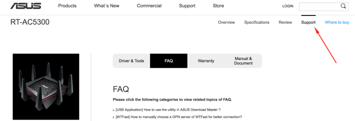

<br>&emsp;&emsp;&emsp;4. 选择**驱动和工具**按钮：

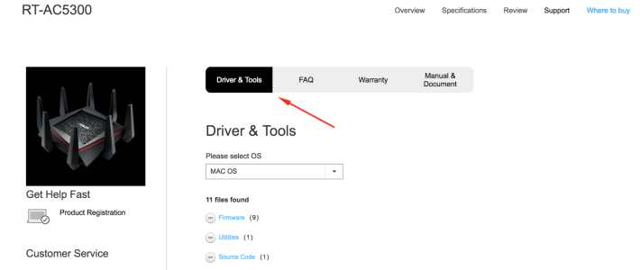

<br>&emsp;&emsp;&emsp;5. 点击下载链接:

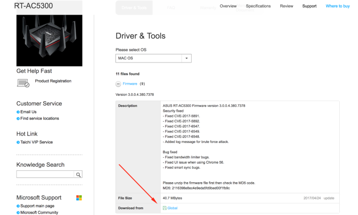

<br>&emsp;&emsp;&emsp;6. 可选地，你可以拷贝链接地址在你的测试机器上使用wget下载文件（wget <http://URL.com>）:

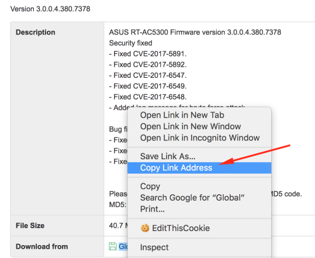

#### 3.3.2.2 设备更新时代理或者镜像流量

有时从厂商网站获取固件镜像不是一个很好的选择，你就需要进行第二步：在设备更新时代理流量，或者第三步：从设备上dump镜像。为了在设备更新时代理流量，你必须在执行更新功能时进行中间人（MITM）或者镜像设备流量。另外，你需要代理web或者移动应用来抓取固件下载的URL。

你也可能需要调整用户代理的头部，由于厂商知道验证固件下载的这个值。下面是使用Kali Linux、Ettercap、Wireshark、SSLtrip在设备上使用MITM进行流量监控的基本步骤。Kali Linux以及安装了本节需要使用的所有工具：

Tips: 有一些方法和工具可以用来代理到设备或者出设备的流量。下面的例子只是一个方法来完成流量捕获。

<br>&emsp;&emsp;&emsp;1. 使能IP 转发：

```java
echo 1 > /proc/sys/net/ipv4/ip_forward
```

<br>&emsp;&emsp;&emsp;2. 配置iptables重定向流量从目标端口80到端口10000，这是SSLstrip监听的端口：
```java
iptables -t nat -p tcp -A PRETOUING --dport 80 -j REDIRECT --to-port 10000
```


<br>&emsp;&emsp;&emsp;3. 启动SSLstrip：

```java
sslstrip -a
```

<br>&emsp;&emsp;&emsp;4. 启动Ettercap GUI：

```java
ettercap -G
```

<br>&emsp;&emsp;&emsp;5. 下图展示了我们已经完成的步骤:

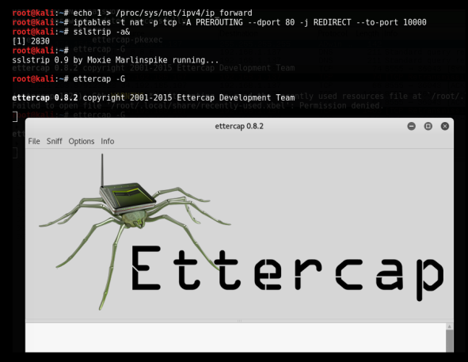

<br>&emsp;&emsp;&emsp;6. 点击 **嗅探（Sniff）** 菜单和 **统一嗅探（Unified sniffing）** 选项:

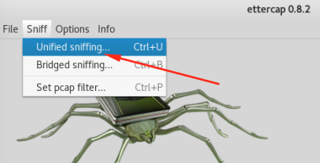
<br>&emsp;&emsp;&emsp;7. 选择接口:

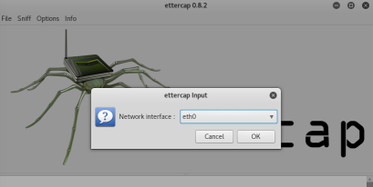

<br>&emsp;&emsp;&emsp;8. 选择 **扫描主机（Scan for hosts）** :

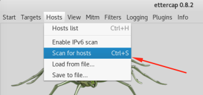
<br>&emsp;&emsp;&emsp;9. 打开Wireshark来查看流量:

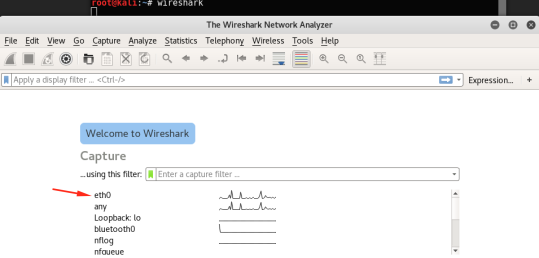

<br>&emsp;&emsp;&emsp;10. 通过点击 **开始捕获包（Start capturing packets)** 来开始捕获目标设备上的流量:

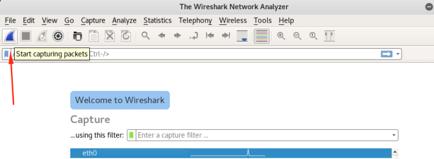
<br>&emsp;&emsp;&emsp;11. 过滤需要的流量；本案例中，`192,168.1.137`是目标设备:

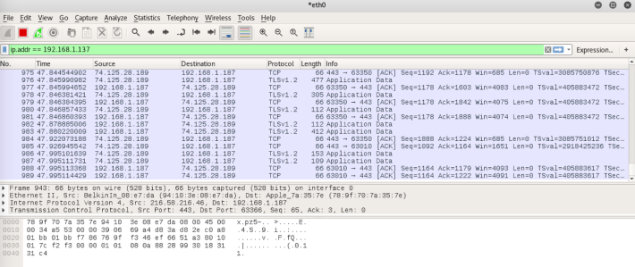


#### 3.3.2.3 直接从设备中dump固件

如果我们不能通过厂商网站和代理流量获取固件镜像，我们可以开始通过UART,SPI,或者JTAG获取设备固件。直接获取固件需要访问设备并反编译设备来查找flash存储。一旦定位到flash存储芯片，你可以直接连接UART引脚或者用一个8引脚SOIC芯片夹使用flashrom和SPI使能的硬件板来dump固件，下面是SOIC芯片和Shikra连接到设备的示意图：

<center>
    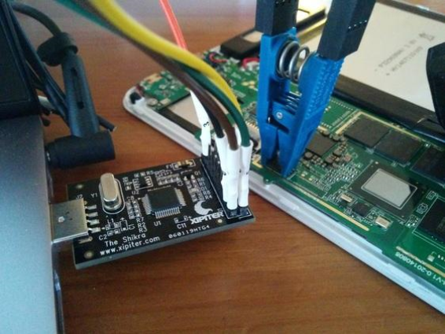
    <br>
    <div style="color:orange; border-bottom: 1px solid #d9d9d9;
    display: inline-block;
    color: #999;
    padding: 2px;">Image Source: http:/b/bwww.bxipiter.bcom/buploads/b2/b4/b4/b8/b24485815/b9936671_borig.bjpgb562</div>
</center>

用来dump固件内容到二进制文件的命令像下面这样：
```java
$ flashrom -p ft2232_spi:type=232H -r spidump.bin
```
如果我们已经使用flashrom或者上述任何一种方法获取到了一个设备的固件，我们现在就可以开始分析固件二进制文件了。
#### 3.3.2.4 谷歌搜索

如果因为一些原因不能用上述方法获取任何固件，我们最后的选择就是求助Google。这可能不是我们的最终选择，如果我们依赖于其他人的工作或者检查我们的设备已经被研究过。有可能，一个在岗或者前员工已经上传固件文件到他们的私人仓库或者web服务器上。在本案例中，我们可以使用谷歌dorking技术来缩小我们的目标设备的搜索范围。我们也可以使用谷歌Hacking数据库搜索固件和设备，网址为[https://www.exploit-db.com/google-hacking-databaseK](https://www.exploit-db.com/google-hacking-databaseK)。

### 3.3.3 How it works...

本节中，我们浏览了：通过厂商网站获取固件，设置中间人测试床来捕获设备流量，直接从设备上dump固件，和谷歌搜索作为最后的选择。这里，我们说明为什么我们使用这些方法获取固件。

当从厂商网站下载固件时，你可以通过他们的支持站点，文件共享或者社区论坛找到你需要的东西。有时，厂商需要密码来下载固件或者ZIP文件使用密码来保护固件。如果这样，在下面的时间，我们会跳到下一步来获取固件。


