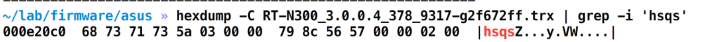
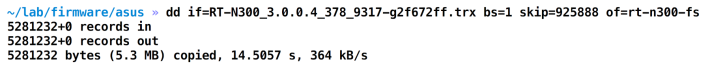
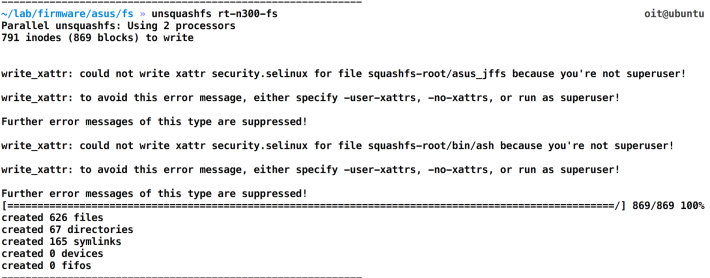
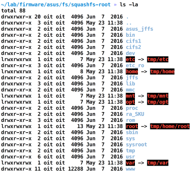
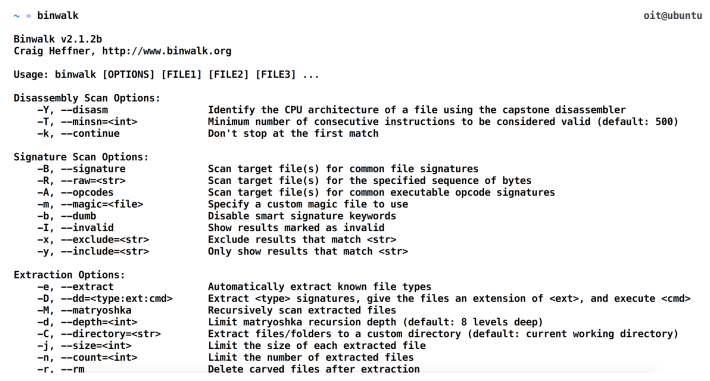
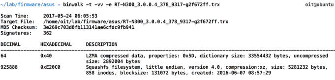
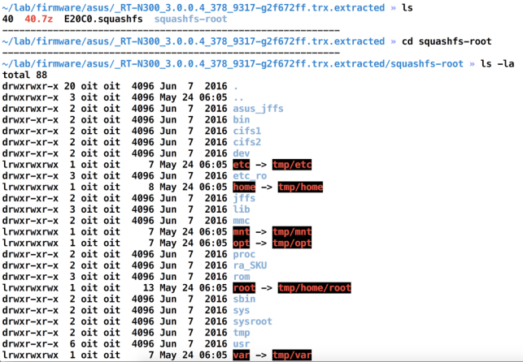
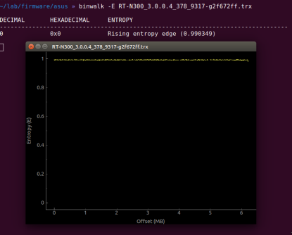

## 3.4 分析固件

一旦我们有了固件，现在最重要的步骤是分析固件。这涉及到查看固件内部和尝试尽可能多地发现安全问题，这就是本章我们要做的事情。

### 3.4.1 Getting ready

本章中，我们将会理解只要能够访问固件二进制包，就能知道如何分析固件。有一些我们可以查看固件内部并识别安全问题的技术，在这一节，我们将会介绍如何开始并识别一些常见安全问题。

正如早前提到的，渗透测试员对固件中很多内容感兴趣，包括API keys，私密证书，硬编码认证信息，后门，甚至更多。
### 3.4.2 How to do it...

为了分析固件，我们将会对它进行逆向工程，并查看它的内部组件。固件的内部组件包括很多，如引导，内核，文件系统，和其他的资源。除了这些，我们对文件系统最感兴趣，这是因为文件系统里有我们要找的秘密。显而易见地，您可以使用引导加载程序并查看它所拥有的内容或修改它并创建新固件（我们将会在下面的章节介绍，但是，在这个时间点上，我们只关注于如何逆向固件和从中提取文件系统。

固件，正如我们知道的，是一个二进制文件包。文件系统仅仅是存储在二进制文件一定位移并由一定的大小的组件之一。然而，在这个时间点上，我们至今不知道固件内的文件系统的一点信息，包括唯一和大小。为了找到这些，我们需要使用一个工具，如hexdump和grep，用于我们正在寻找的各种内容的签名。下面是Squshfs文件系统的一个例子：

<br>&emsp;&emsp;&emsp;1. 如果我们想查看Squashfs文件系统，我们可以查找hexdump输出的逆序shsq（这是很多Squashfs文件系统的魔数字节），如下所示：



<br>&emsp;&emsp;&emsp;2. 正如你看到的，我们可以识别出，Squashfs文件系统是从地址0x000e20c0。我们有了这个信息后，我们可以使用dd工具dump从这个地址开始到结束的内容，如下所示：



<br>&emsp;&emsp;&emsp;3. 一旦我们有了从固件二进制文件中雕刻出来的Squashfs内容，然后我们可以运行一个工具简单地查看全部文件系统。让我们继续，并允许unsquashfs，我们就可以看到全部文件系统了：



<br>&emsp;&emsp;&emsp;4. 正如我们从上述截图中看到的一样，我们可以提取Squashfs文件镜像。忽略上述图片中的警告和错误，由于它只是告诉我们没有以root身份运行命令。一旦我们提取出它，我们可以导航到很多目录并查看单独的文件，来识别漏洞。下面的截图是关于如何查看整个文件系统：



这就是我们如何逆向固件并从固件二进制镜像中提取文件系统。我们也可以使用binwalk来自动化地执行上述步骤。Binwalk是Craig Heffner编写的，可以用一条指令就可以从固件二进制镜像中提取文件系统。

<br>&emsp;&emsp;&emsp;5. 安装Binwalk，简单地从[]()克隆它的GitHub仓库就行:

```java
git clone https://github.com/devttys0/binwalk.git
```
<br>&emsp;&emsp;&emsp;6. 运行 `./deps.sh`安装所有需要的依赖和二进制文件:


<br>&emsp;&emsp;&emsp;7. 成功安装Binwalk后，你可以简单地通过执行Binwalk，并回车。这会显示Binwalk的帮助菜单：



<br>&emsp;&emsp;&emsp;8. 我们继续，使用Binwalk进行同一个固件的文件系统提取，为了完成这个，我们用-e标志，这会进行提取：

```java
binwalk -e [firmware-name]
```

<br>&emsp;&emsp;&emsp;9. 这会给我们展示固件里的许多部分，并提取内容:



<br>&emsp;&emsp;&emsp;10. t和vv标签允许我们打印更可读的输出，并用详细格式。Binwalk提取后，我们可以进入以_[firmwarename].extracted命名的目录，这里存储了全部的文件系统，如下截图所示:



这就是我们如何从一个固件二进制中手动和自动化提取文件系统。

### 3.4.3 How it works...

本案例中，文件系统提取使用了我们前面进行的相同的方法。它使用魔术字节和头部签名字符来检测文件系统和其他组件。像Squashfs的sqsh等等。Binwalk检测的文件系统数量可以在这里找到[https://github.com/devttys0/binwalk/blob/62e9caa164305a18d7d1f037ab27d14ac933d3cf/src/binwalk/magic/filesystems](https://github.com/devttys0/binwalk/blob/62e9caa164305a18d7d1f037ab27d14ac933d3cf/src/binwalk/magic/filesystems)

你也可以手动添加更多的签名到你的Binwalk实例中，并编译它来检测这些其他的文件系统。

### 3.4.4 There's more

你也可以使用Binwalk进行一些其他的操作，例如检测一个给定固件镜像的熵。这可以帮助你识别固件是否被压缩或者被加密了。为了进行熵分析，使用-
E标签运行Binwalk，固件名称跟在后面，如下面的截图所示：



正如你在前面截图中看到的，这个固件并没有被加密，因为你在加密的固件映像中找不到大的变化。

### 3.4.5 See also

* 固件分析和逆向工程的跟多信息，Binwalk的作者Craig Heffer的博客，是及其有用的。它也会帮助你理解固件镜像是如何不一样的，和是易受攻击的。博客地址在[http://www.devttys0.com/](http://www.devttys0.com/)。
