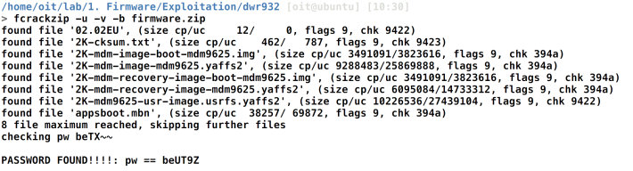
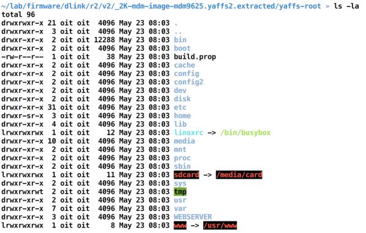
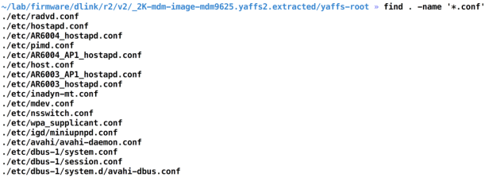

## 3.5 分析文件内容

我们现在知道如何逆向固件，并从中提取文件系统。本节中，我们将会查看文件系统内容和进行其他的漏洞分析。这会帮助我们获取深入的理解如何找到固件镜像中的安全问题，使用这些，我们能够利用一个IoT设备。

### 3.5.1 Getting ready

有两个方法分析文件内容：

* 手动分析
* 自动化工具和脚本

#### 3.5.1.1 手动分析

用这种方法在固件文件系统中寻找漏洞，我们对文件系统中的很多文件和目录进行分析。这会查找许多内容，包括配置文件，web目录，密码文件，寻找后门等等。这是在给定固件中发现漏洞的理想化方式，将会是本节的重点。

#### 3.5.1.2 自动化工具和脚本

截止到本书出版时，除了一些脚本，还不存在一个完整的框架或者工具能够帮助我们寻找固件中的漏洞。所以如果你熟悉web应用安全或者网络安全，是没有像Arachni，w3af，，Metasploit这样的类似工具的。

### 3.5.2 How to do it...
让我们开始分析固件，看看我们能不能找到任何的敏感信息或者后门。

本次使用的固件是D-Link DWR 932B，版本是DWR-932_fw_revB_2_02_eu_en_20150709。安全研究生已经发现了这些漏洞：Gianni Carabelli和Pierre Kim:
<br>&emsp;&emsp;&emsp;1. 第一步是从固件中提取文件系统。然而，本案例中使用的固件ZIP文件被密码保护了，密码可以用一个像fcrackzip的工具破解，密码是UT9Z。这如下图所示：

<br>&emsp;&emsp;&emsp;2. 获取到镜像后，我们可以用Binwalk提取固件ZIP文件中的yaffs2文件系统。你可以使用yaffs2-specific工具解文件系统的包或者简单地使用Binwalk也能完成这个任务。


<br>&emsp;&emsp;&emsp;3. 在`yaffs2-root`文件夹内，将会有全部的文件系统，如下图所示：



<br>&emsp;&emsp;&emsp;4. 从这里开始，我们可以导航到很多目录了，并且查看从安全视角感兴趣的文件。我们可以做的第一件事就是执行`find`查找所以的`.conf`配置文件文件，如下截图所示：



<br>&emsp;&emsp;&emsp;5. 例如，这就是`wpa-supplicant/conf`文件内容:


<br>&emsp;&emsp;&emsp;6. 查看其他的文件，例如`inadyn-mt.conf`:


意外的是，这个文件包含了不允许访问的极敏感的信息。我们可以从上述截图看到，这个文件存储了路由器的no-IP配置，包括了用于访问`https://www.no-ip.com`用户名和密码组.

这就是我们如何找到固件中的敏感信息。显而易见地，你可以查看更多，找到固件文件系统中的更多敏感信息。

现在我们知道了如何进行收到分析固件，我们将会继续通过自动化方法寻找缺陷。对于这个，我们将会使用Firmwalk工具，Craig Smith编写的，可以通过静态分析帮助我们识别固件中的常见敏感信息。

<br>&emsp;&emsp;&emsp;7. 设置Firnwalk，我们需要克隆它的GitHub仓库，如下所示：

```java
git clone https://github.com/craigz28/firmwalker.git
```

<br>&emsp;&emsp;&emsp;8. 克隆了Firmwalker的Git仓库后，我们只需要运行`./firmwalker.sh`脚本，并带上提取的文件系统位置即可，如下所示：

```java
./firmwalker.sh ~/lab/firmware/dlink/r2/v2/_2K-mdm-image-mdm9625.yaffs2.extracted/yaffs-root
```

<br>&emsp;&emsp;&emsp;9. Firmwalker脚本为我们识别出了一些不同的东西，包括额外的二进制文件，证书，IP地址，私钥，等等。它也此将输出存储在`firmwalker.txt`文件中，（除了用户指定了不同的文件名），内容看起来如下图所示：


一旦我们有了Firmwalker生成的报告，我们可以单独地查看不同的文件并深入分析。有些地方，你也需要逆向基于ARM或者基于MIPS的二进制来更多地理解他们并识别漏洞。
### 3.5.3 How it works...

分析和理解文件系统和它的内容是你手动评估技能的全部。这就是你怎样能够识别漏洞。甚至当使用很多工具时，你会意识到，它其实就是手动分析该二进制文件或文件并找出漏洞。

### 3.5.4 There's more

为了对固件进行更深级别的分析，你也可以使用像固件差异技术，可以比较固件及其老版本的差异并查看。这能让你理解安全修复和新版本中的修改，甚至识别早起版本中没有修复的安全问题。

我们可以用固件文件系统内容做的另一件事查看使用的很多lib库和组件，并查看这些是不是过期的有漏洞的版本。

### 3.5.5 See also

* 对于分析固件文件系统内容，最好读更多的二进制分析和逆向工程知识。让你自己熟悉Linux二进制分析，并在ARM和MIPS平台进行反编译。