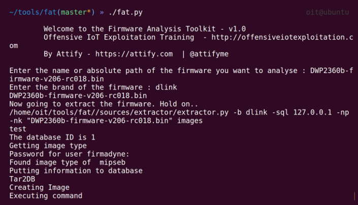
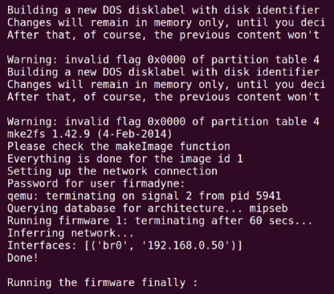
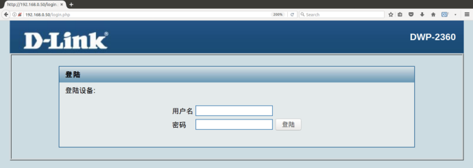

## 3.6 仿真固件进行动态分析

当工作中使用IoT设备时，常常遇到的限制是访问不到设备的话，我们不能进行大量的测试和利用。然而，本部分，我们将会讨论一个方法，你可以仿真你的设备并与其交互，即使它是你的网络中的一个实际设备。
### 3.6.1 Getting ready

为了仿真固件，我们将会使用一个脚本 **Firmware Analysis Toolkit（FAT）**，是本书作者编写的。FAT使用Firmadyne来进行固件镜像的仿真。

Firmadyne主要使用的工具是QEMU，这允许用户仿真整个系统架构并在上面运行内容。它也较好地利用了其他的脚本，例如NVRAM仿真器，网址在[]()。它也使用了工具，像我们之前讨论过的Binwalk，来提取稍后仿真的文件系统。

让我们继续，克隆FAT GitHub仓库，并设置好为仿真做好准备。我们非常建议在Ubuntu系统中执行这些，避免仿真中的一些问题。

### 3.6.2 How to do it...
下面是步骤：

<br>&emsp;&emsp;&emsp;1. 我们以克隆FAYT仓库开始，链接为[https://github.com/attify/firmware-analysis-toolkit](https://github.com/attify/firmware-analysis-toolkit),如下所示：

```java
git clone --recursive
https://github.com.attify/firmware-analysis-toolkit.git
cd firmware-analysis-toolkit && sudo ./setup.sh
```

我们也要设置Firmadyne使用的数据库来存储固件信息和未来的管理信息。数据库的访问密码设置成`firmadyne`。

一旦你设置好所有东西，就是我们拿到固件并仿真的时候了，并查看我们可以利用仿真的固件来做什么。

对这个练习，我们将会使用DWP2360b固件，这是D-Lik的无线PoE AP的固件。

<br>&emsp;&emsp;&emsp;2. 我们需要做的第一件事就是执行`./fat.py`，这会询问你固件名称和固件镜像品牌。这个固件品牌主要是用于数据库目的，所以我们可以根据需要查看数据库，看看我们模拟的是什么品牌的固件。你运行后，看起来就如下图所示：



<br>&emsp;&emsp;&emsp;3. 他会询问你数据库密码，我们设置成`firmadyne`。它完成初始化过程，创建镜像，设置网络和获取IP地址后，将会显示你的IP地址，并提示固件正在仿真，如下截图所示：



<br>&emsp;&emsp;&emsp;4. 我们有了IP地址后，我们可以简单地在浏览器中打开该IP地址，我们将会看到路由器登录界面，如下截图所示：



这就是我们如何使用FAT仿真固件，甚至都没有访问设备。

### 3.6.3 How it works...

前面的仿真是基于QEMU和NVRAM仿真器的。NVRAM是一个固件访问获取设备信息的组件。然而，由于没有物理设备，将会导致拨打电话的服务出错或者崩溃。Firmadyne也为了debug目的修改了固件让用户访问控制台。

下面就是FAT脚本中发生的事情：
<br>&emsp;&emsp;&emsp; 1. 从固件中提取文件系统。
<br>&emsp;&emsp;&emsp; 2. 获取固件的架构
<br>&emsp;&emsp;&emsp; 3. 制作需要的镜像
<br>&emsp;&emsp;&emsp; 4. 设置网络
<br>&emsp;&emsp;&emsp; 5. 仿真镜像

全部步骤都可以手动进行，但是FAT脚本可以加速这些事情。

### 3.6.4 There's more

另一个仿真的方法是手动下载正确架构的Debian镜像，从固件中拷贝文件到新创建的Debian实例中，然后用Chroot运行web服务器（或者你测试的组件）。你可以下载存在的Debian镜像从这里[https://people.debian.org/~aurel32/qemu/](https://people.debian.org/~aurel32/qemu/)。