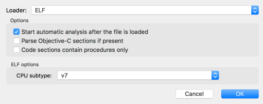
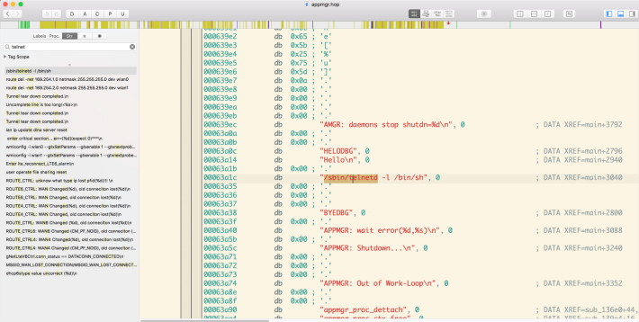
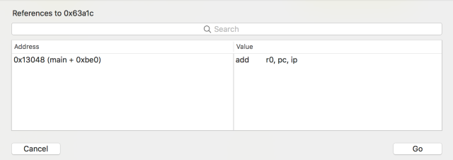
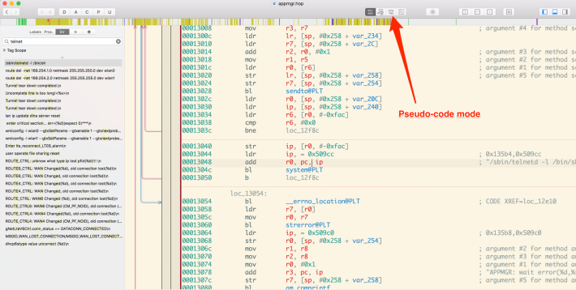
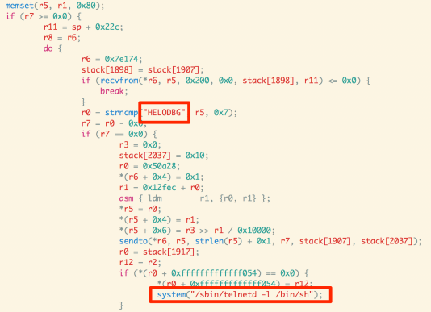

## 3.7 开始ARM和MIPS

现在我们知道了如何仿真固件并进行基本的分析，你会常常发现自己要穿越各种二进制文件，并需要额外的分析。在一本简单的书中覆盖全部嵌入式神的架构是不可能的，我们将会关注两个主流的架构--ARM和MIPS。

然而，我们只看一下MIPS的利用，并看一下ARM的逆向工程。从利用的视角，ARM和MIPS是相似的，学习一个架构会让你有一个良好的开端和对另一个的基本理解。
### 3.7.1 Getting ready

我们将会以分析D-Link固件中发现的后门来开始我们的固件分析旅程。这个后门是被Pierre Kim发现的。为了找到这个后门，需要掌握基于ARM的二进制的逆向工程。即使我们不深入到寄存器和架构（由于我们准备在MIPS架构覆盖这些），这部分将会帮助你理解分析二进制的过程和识别低悬的漏洞。

本案例中使用的固件是设备D-Link DWR 932B的。我们使用Binwalk提取出固件，我们注意到，有一个称作appmgr的二进制文件，是我们感兴趣的文件。

我们可以使用任何你熟悉的反汇编器，如Radare2，IDA,Hopper等等。本案例中，我们将会使用Hopper来逆向appmgr二进制，这是ARM小端的二进制文件。

### 3.7.2 How to do it...

我们将使用Hoper的伪代码生成功能来更好地理解它，下面是步骤：

 &emsp;&emsp;&emsp;1. 我们在Hoper中加载二进制进行分析：

 &emsp;&emsp;&emsp;2. 加载了二进制后，我们可以搜索`telnet`字符串，我们会看到代码中被标记的`telnet`：

 &emsp;&emsp;&emsp;3. 为了找到它是在哪被调用的，我们可以在字符串上右击，并选择 **地址引用(Reference to address)** ，这会向我们展示它被调用的位置和指令、本案例中，如果我们进行 **地址引用** ，我们发现它在0x13048被调用，如下截图所示：

 &emsp;&emsp;&emsp;4. 双击地址会带我们进入相应的地址，本案例中，是0x13048.我们在这个地址后，我们可以通过点击 **伪代码模式（Pseudo-code mode）** 按钮，看到整个反汇编的也就是生成的伪代码，如下截图所示：

 &emsp;&emsp;&emsp;5. 伪码模式对我们是及其有用的，由于它可以让我们看到反汇编的逻辑代码对我们更有意义，如果我们对反汇编及其不熟悉的话。本案例中，下面就是伪码的内容：

正如我们在上述截图中看到的，它对字符串`HELODBG`进行了`strncmp`方法。正如你可能已经知道的，`strncmp`是用于字符串比较的，本案例中，是用来检测二进制用来运行Telnet的，如明显的高亮框中那样。

因此，我们可以自信的说appmrg后面查看字符`HELODBG`，一旦受到字符串，就会使用`bin/sh`shell发起Telnet。

这就是我们如何进行ARM二进制的一个基础分析，这可以被用来寻找敏感信息和或者漏洞和后门。

### 3.7.3 There's more

现在我们知道如何对ARM二进制进行基础分析了，我们也要建议你阅读更多关于ARM汇编码和架构。关于汇编码指令和基础架构的知识和理解会帮助你更容易地理解汇编码，甚至那时候伪码就没用了。