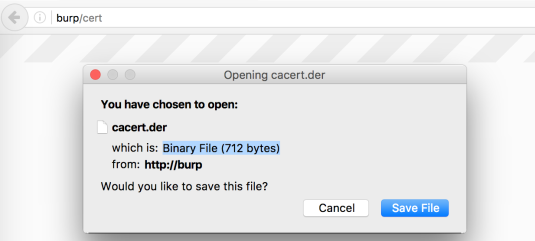
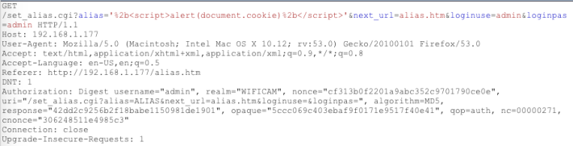
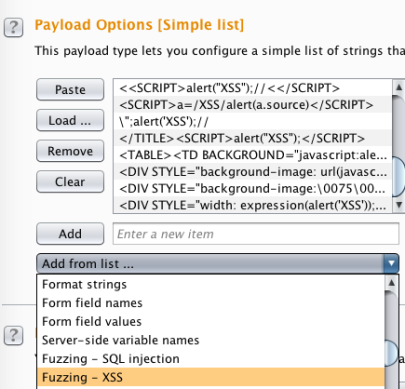

## 4.3 使用Burp Suite
Burp Suite是一个用于评估web应用的最流行web代理工具。Burp是基于Java的跨平台工具。利用Burp Suite，Http的请求和响应可以以中间人的方式达到篡改和监控应用行为的目的。除此之外，应用可以被爬取内容（spidered）、主动漏洞扫描、被动扫描和fuzzed。
### 4.3.1 getting ready
Burp Suite以及提前安装在虚拟机中，而且，可以在[https://portswigger.net/burp/](https://portswigger.net/burp/)下载。

Burp有两个版本：免费版和专业版。专业版包含了Burp的特性，价格为$349.00 USD。专业版有两周的试用期。免费版允许代理Http的请求和响应，也支持BApp商店的一些插件下载。专业版允许使用更多高级特性和专业插件。

### 4.3.2 How to do it...
我们将要简单学习Burp Suite的基本使用来开始嵌入式web应用的测试。下面的实例使用的是Burp专业版；然而，免费版也支持相同的步骤：
 &emsp;&emsp;&emsp;1. 设置Burp Suite代理监听127.0.0.1，端口8080，如下截图所示：

 &emsp;&emsp;&emsp;2. 使用FoxyProxy设置浏览器代理为上一步Burp Suite监听的地址：

 &emsp;&emsp;&emsp;3. 选择配置的代理将所有的流量路由到Burp的代理监听器：

 &emsp;&emsp;&emsp;4. 然后，我们需要下载和安装Burp的CA证书，通过进入网址[http://burp/cert](http://burp/cert),保存证书到一个文件夹，并导入证书到浏览器的证书管理器。允许代理Https连接的Burp证书可能即将派上用场。

 &emsp;&emsp;&emsp;5. 在Firefox浏览器切换到[about:preferences#advanced](about:preferences#advanced),并且选择证书，然后授权：

 &emsp;&emsp;&emsp;6. 点击Import按钮，选择之前保存在本地的Burp Suite证书：

现在我们可以查看HTTP/HTTPS的请求和响应了。

 &emsp;&emsp;&emsp;7. 我们对浏览器和Burp Suite进行了基本的代理设置后，导航到目标web应用。通过右击网站地址并选择**add to scope**将目标网站添加到范围（scope），如下图所示：

 &emsp;&emsp;&emsp;8. scope选定之后，可以通过右击一个请求并选择**Do a active scan**，就可以扫描请求了。

 &emsp;&emsp;&emsp;9. 通过导航到**Scan queue**可以查看扫描结果：

 &emsp;&emsp;&emsp;10. 有时，我们可能想要使用**Repeater**重放请求观察响应或者为了调整负载（payload）。可以通过右击目标请求并发送到**Repeater**完成。下图显示了使用payload调整alias参数的请求：

 &emsp;&emsp;&emsp;11. 当以调整payload为目标时，我们可以利用Burp Suite的编码器功能对特点的字符进行编码或者解码来保证payload的执行。下图展示了一个解码（上）的值被编码（下面）的功能。

 &emsp;&emsp;&emsp;12. 一个更手动地用特定目标payload进行fuzz参数的方法可以用Burp Suite的**Intruder**。首先，需要指定一个目标参数。在这里，我们使用alias参数作为目标：

 &emsp;&emsp;&emsp;13. 然后，选择使用的攻击payload（这里使用**Fuzzing-XSS**），并点击**开始攻击（Start atack）**

 &emsp;&emsp;&emsp; 一个分离的窗口将会弹出，可以看到攻击结果：

### 4.3.3 How it works...

### 4.3.4 There's more...

Burp Suite有一个强大的社区。当新的攻击技术被发现，社区以及创建大量的插件扩展。Burp Suite也是。PortSwigger通过不断更新Burp来保持其领先地位，做得非常好。可以查看大量的Release说明，还可能学到点东西[http://releases.portswigger.net/](http://releases.portswigger.net/)

#### 4.3.3.1 有用的侵入payload
当使用Intruder,对fuzz的目标参数设置一个目标payload集合是个非常好的想法。**SecList**项目可以为更多的攻击提供大量的词列表即fuzz payloads。该项目由社区提供日常更新来辅助测试。**SecList**仓库可以通过URL找到[https://github.com/danielmiessler/SecLists/](https://github.com/danielmiessler/SecLists/)

### 4.3.5 See also
* 如果你发现你需要为一个自定义的目的创建宏或者一个插件，可以看一下Burp的扩展API，URL是[https://portswigger.net/burp/extender/](https://portswigger.net/burp/extender/)