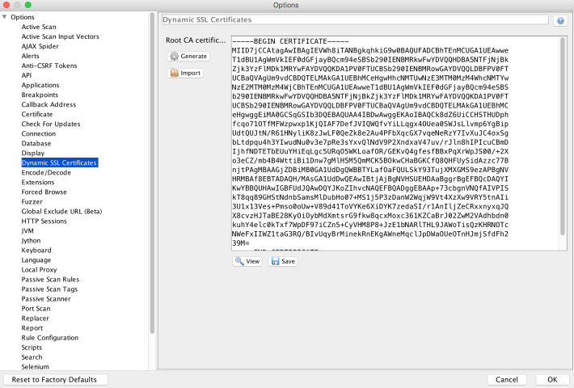
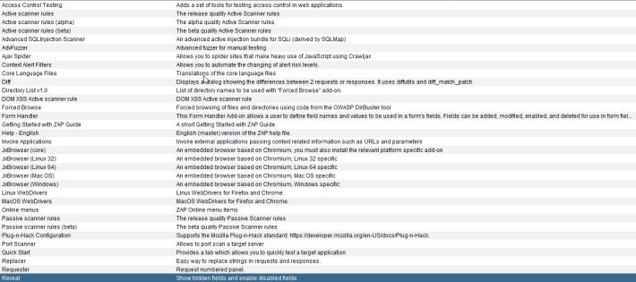
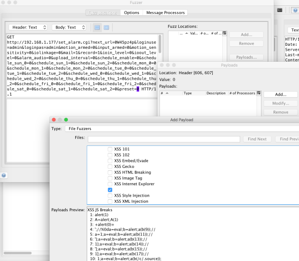

## 4.4 使用OWASP ZAP

OWASP的**Zed Attack Proxy**是一个用于发现web应用漏洞的跨平台web代理测试工具。在web应用代理测试领域，ZAP是仅次于Burp的亚军,当你的预算不足以支持Burp Suite的商业许可是，ZAP确实是首选。ZAP是专为经验丰富的人使用，像对开发者和渗透测试新手的功能测试者是非常友好的。利用ZAP的API，可以进行自动化扫描和用于开发流程中商用前的扫描构建。ZAP的扫描引擎有大量有用的插件，其中包含其他被验证过的测试工具，例如Dirbuster和SQLmap。此外，ZAP有一个图脚本语言ZEST，可以记录和重放请求，与某一类宏一样。本节将介绍ZAP用于web用于安全测试的基本特性。

### 4.4.1 Getting ready
ZAP已经预装在虚拟机中；然而，可以通过以下链接下载：[https://github.com/zaproxy/zaproxy/wiki/Downloads](https://github.com/zaproxy/zaproxy/wiki/Downloads).

ZAP下载页包含单独的Docker镜像和包含官方release没有的特性的每周版本。每周的release稳定性很高，如果你想利用更多的扩展，我建议尝试一下。

### 4.4.2 How to do it...
以下步骤将会介绍ZAP的设置和基本使用：
 &emsp;&emsp;&emsp;1. 通过点击**Tools**，然后**Options**设置ZAP代理监听器。输入ZAP监听的IP和端口信息，如下截图所示：

 &emsp;&emsp;&emsp;2. 使用**Dynamic SSL Certificate**选项生成并安装ZAP的CA证书，并在浏览器中安装证书，和Burp Suite中类似：

 &emsp;&emsp;&emsp;3. 保存证书到一个已知的文件夹：

 &emsp;&emsp;&emsp;4. ZAP中有很多辅助主动和被动web渗透测试的插件，会意识你安装。这些需要使用的插件是**Advanced SQLInjection Scanner**、**Active scannner rules(alpha)**、**DOM XSS Active scanner rule**、**Passive scanner rules(alpha)**和**使用Wapplyzer的技术检测**。ZAP的插件有成熟度度量，但是使用alpha级别的插件一点都没关系。下图证明了必要的插件：

 &emsp;&emsp;&emsp;5. 安装完需要的插件后，可以通过**Analysis**和**Scan Policy Manager**选项配置扫描策略。这些策略支持导入导出。下图展示了即将使用的XSS扫描策略:

ZAP的扫描策略包含了一个阈值(Threshold)和强度(strength)。阈值属于警告置信度和ZAP报告潜在漏洞的可能性。强度表示ZAP将会进行的攻击数量。这些信息可以在ZAP的用户指南中找到。可以在工具中或者在线网址[https://github.bcom/bzaproxy/bzap-bcore-bhelp/bwiki](https://github.bcom/bzaproxy/bzap-bcore-bhelp/bwiki)。

 &emsp;&emsp;&emsp;6. 我们的扫描策略配置好之后，我们需要通过右击目标网址添加目标站点到context中，正如下图所示。这与Burp的**Add to Scope**相似：

现在我们可以查看HTTP/HTTPS的请求和响应了。

 &emsp;&emsp;&emsp;7. 现在目标网址已经被包含在上下文中等待扫描：

 &emsp;&emsp;&emsp;8. 通过右击目标请求可以完成对一个请求的扫描，选择你的扫描策略，并且开始扫描，如下图所示：

上图选择了XSS扫描策略，扫描即将开始，并且结果会输出到ZAP中的"Active Scan" tab项。

 &emsp;&emsp;&emsp;9.一个更有目标性的方法激活扫描，利用ZAP的fuzz特性，与Burp的Intruder相似。为了fuzz，右击请求并选择fuzz位置（location）和负载（payloads），如下图所示：

 &emsp;&emsp;&emsp;10. 解码和编码对代码执行是很重要的。ZAP的Encoder/Decoder，可以通过**Tool**菜单，和Burp Suite的解码器使用相似，如下图所示：

### 4.4.3 There's more
ZAP是极易于定制和扩展的。我们上述讲解只包含了用于辅助web应用安全测试的基本使用。想学习更多的使用和自定义ZAP，可以浏览ZAP的blog，也就是他们的Wiki连接[https://github.com/zaproxy/zaproxy/wiki](https://zaproxy.blogspot.com/)和[https://github.com/zaproxy/zaproxy/wiki](https://zaproxy.blogspot.com/).

此外，如果想利用Burp Suite和ZAP来磨练自己的web应用测试技能，可以查看OWASP的Vulnerable Web Application Directory Project,可以通过网址[https://www.owasp.org/index.php/OWASP_Vulnerable_Web_Applications_Directory_Project](https://www.owasp.org/index.php/OWASP_Vulnerable_Web_Applications_Directory_Project)找到。