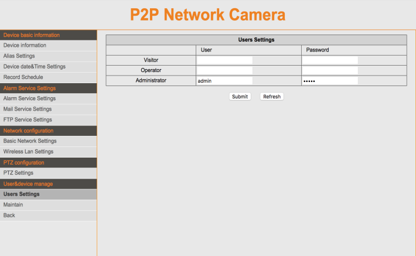
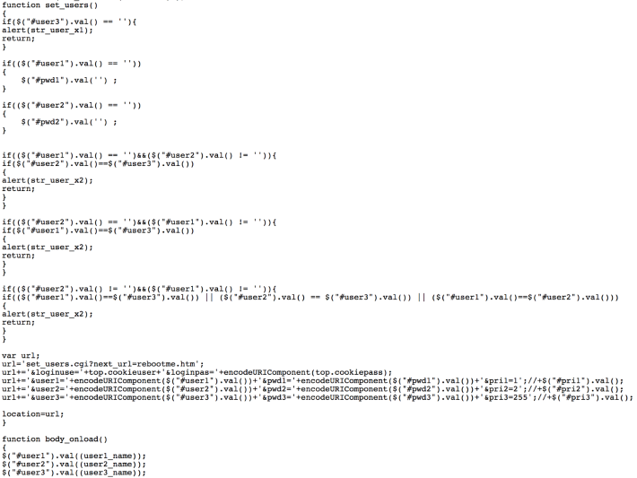
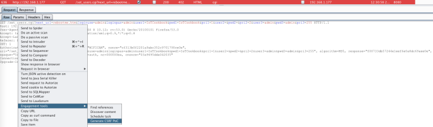
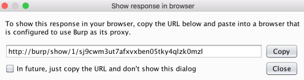
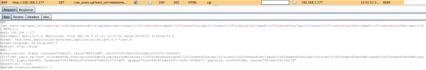
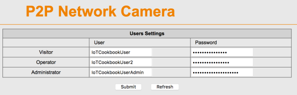

## 4.7 利用CSRF

CSRF是一个攻击，可以用诡计诱骗受害者用自己的身份提交一个恶意的请求，在受害者身上执行其不期望的功能。对于大部分应用，浏览器会自动包含一些相关的session信息，例如 用户的session cookie，token， IP地址，有时候也会包含窗口域的认证NTLM哈希值。如果受害者用户完成了某个网站的认证，网站将无法分辨被受害者发送的伪造请求和合法请求。

CSRF攻击的目标应用功能会导致服务器的状态改变，例如改变受害者的邮箱地址、密码，或者许多其他的应用配置。当攻击成功时，敌人是不会受到响应的，只有受害者受收。因此，CSRF攻击是以一个自动的方式执行请求来改变服务器的状态。嵌入式IoT设备因为受限的硬件计算复杂度，难以保持一个anti-CSRF token，而经常受到CSRF攻击的影响。虽然有许多不需要服务端状态的预防设计模式，但是相反要使用应用验证HTTP referrer和 origin头，这些事不高效的解决方法。

CSRF攻击已经被用到了以IoT设备为目标的恶意软件中， SOHO 路由器也也被攻击者控制网络流量，重新路由受害者的流量到DNS服务器， DDoS也是。几个这些恶意软件链被称为SOHO Pharming([https://www.team-cymru.com/ReadingRoom/Whitepapers/2013/TeamCymruSOHOPharming.pdf](https://www.team-cymru.com/ReadingRoom/Whitepapers/2013/TeamCymruSOHOPharming.pdf)), 和 DNSChanger([https://www.proofpoint.com/us/threat-insight/post/home-routers-under-attack-malvertising-windows-android-devices](https://www.proofpoint.com/us/threat-insight/post/home-routers-under-attack-ma
lvertising-windows-android-devices))。本节中，我们将会展示在一个目标设备上利用CSRF。

### 4.7.1 Getting ready

为了利用CSRF，我们需要使用Burp Suite和一个易受攻击的IHOMEECAM ICAM-608 IP相机。

### 4.7.2 How to do it..

发现一个应用是否能被CSRF利用的第一步是观察可以改变应用状态的请求参数和HTML表格值。如果，每个参数没有随机token或者HTML表单中没有硬编码token，我们就有机会来进行CSRF攻击了。我们想看一下，改变对攻击者有利的敏感配置或者持久化一个像添加用户这种表单到设备中：

 &emsp;&emsp;&emsp;1. 我们观察目标IP相机的设置配置页面和它的源码：

 &emsp;&emsp;&emsp;2. 用户设置页的源码看起来没有包含anti-CSRF的token，并且盲目的将输入参数设置到URL中，不加任何校验：

我们现在可以创建一个**proof of concept(POC)** CSRF HTML页面，其在受害者侧创建三个用户。

 &emsp;&emsp;&emsp;3.首先，我们需要右击易受攻击的HTTP请求，并选择 **Generate CSRF PoC**：

 &emsp;&emsp;&emsp;4. Burp Suite创建了一个我们可以武器化和迎合我们需要的PoC HTML页面。下一步是改变管理员用户的设置和硬编码输入值添加两个新用户。在下面所示图中，我们添加了 IoTCookbookUserAdmin, IoTCookbookUser1,和 IoTCookbookUser2。

 &emsp;&emsp;&emsp;5. 选择**Test in browser**, 会弹出以下窗口：

 &emsp;&emsp;&emsp;6. 复制链接到浏览器中：

 &emsp;&emsp;&emsp;7. 在浏览器中访问URL后，观察发送到Burp Suite代理的请求，里面包含了我们在PoC HTML页面中用于添加用户到IP相机的硬编码输入值：

 &emsp;&emsp;&emsp;8. 刷新IP相机的用户设置页面，可以看到改变生效了：

基于前述提到的恶意软件的相似的策略和技术。可以在给受害者发送CSRF PoC页面时，可以使用。管理员和用户账户可以被自动地创建，允许攻击者利用受害者身份完成未经授权的改变。

### 4.7.3 See also
 &emsp;&emsp;&emsp; * 如果要查看更多指导CSRF漏洞相关的指南，可以参考OWASP的 CSRF Wiki页面[https://www.owasp.org/index.php/Cross-Site_Request_Forgery_(CSRF)](https://www.owasp.org/index.php/Cross-Site_Request_Forgery_(CSRF))