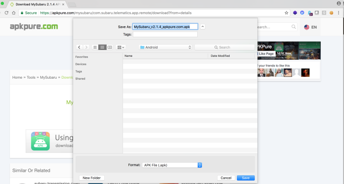
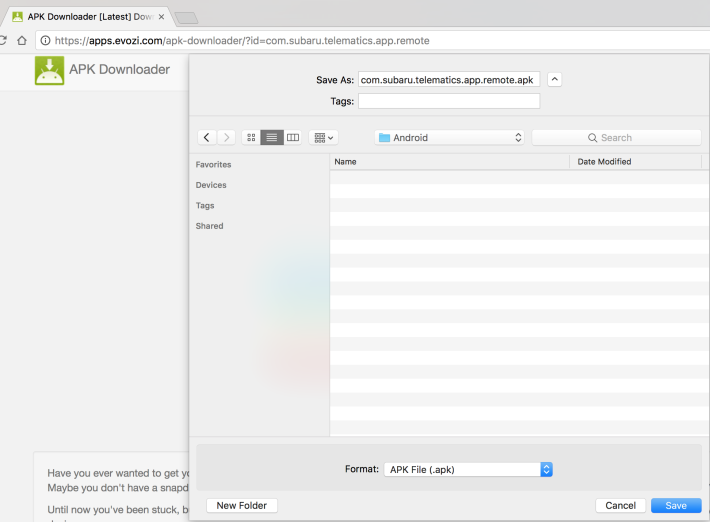

## 5.2 获取IoT移动应用

评估IoT设备的移动应用的第一步是获取和安装目标平台的应用。通常，如果IoT设备有一个Android应用，也就会有一个iOS应用。

### 5.2.1 How to do it...

下一步，我们将讨论获取Android和iOS应用的方法。

 &emsp;&emsp;&emsp;1. Android有大量的第三方应用市场，我们可以在上面下载APK文件。然而，当我们使用第三方应用市场时，有很多注意事项。有时，应用市场没有及时更新应用的版本，或者有一些不正确的应用。在安装应用市场的应用之前，验证应用的hash，版本，和内容是很重要的。一些三方应用声称有你查找的app，但是他们最终被标记为有害应用。在第三方应用市场酷的地方是可以下载老版本以及他们的Release说明.选择一个第三方应用市场，例如[https://apps.evozi.com](https://apps.evozi.com)和[https://apkpure.com/](https://apkpure.com/)，查找目标Android应用，并下载APK，如下截图所示：

下一个截图显示了Subaru应用正在从[https://app.evozi.com](https://app.evozi.com)被下载。

 &emsp;&emsp;&emsp;2. 对于iOS，从一个黑盒视角下载一个IPA文件是更加困难的。与Android相反，没有类似的第三方应用市场选择，这是因为iOS应用被苹果公司的FairPlay DRM加密了。没有必要的工具这对于我们是一个挑战。在下面的内容中，我们将会给出解密iOS应用的流程。如果你关注于iOS测试，可以轻松跳过解密iOS应用章节。

