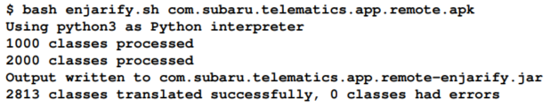
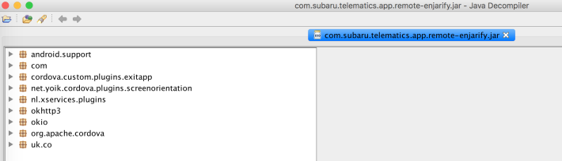
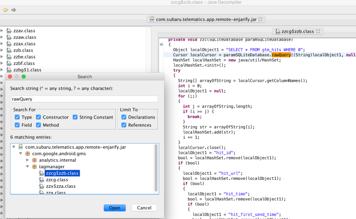
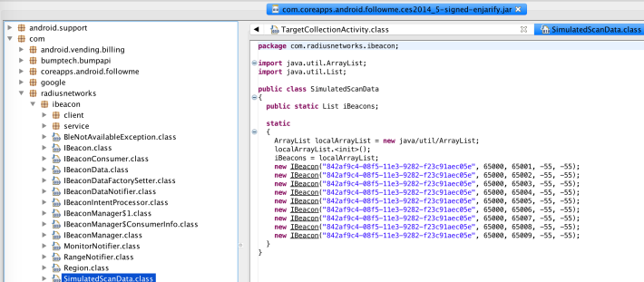

## 5.3 反编译Android应用

目标IoT app和APK文件下载好以后，应用程序就可以被反编译后查看内容了。对于一个Andoid应用，这个任务可以在几分钟内完成。稍后，静态分析app的自动测试技术将会更详细地被覆盖到。反编译是逆向工程一个应用来操作他的函数的第一步。应用也可以在被修改后，被重编译和重打包，然而这超出本书的范围了。

### 5.3.1 Getting Ready

要反编译Android app， 我们将会使用Enjarify和JD-GUI。Enjarify转换Dalvik字节码到Java字节码，这将会利用JD-GUI进行深入分析时用到。JD-GUI是一个用于查看Java代码的Java反编译器。这两个工具都包含在相应的虚拟机里：

 &emsp;&emsp;&emsp; * Enjarify 可以在Github仓库中下载：
[https://github.com/google/enjarify](https://github.com/google/enjarify)
Enjarify 需要Python 3 依赖。

 &emsp;&emsp;&emsp; * JD-GUI也可以在Github仓库中下载：
[https://github.com/java-decompiler/jd-gui/releases](https://github.com/java-decompiler/jd-gui/releases)

### 5.3.2 How to do it...

 &emsp;&emsp;&emsp;1. 首先，进入Enjarify的文件夹路径，并指向目标APK文件。在本案例中，APK文件和Enjarify在同一个目录中：

下一个截图显示了Subaru应用正在从[https://app.evozi.com](https://app.evozi.com)被下载。

 &emsp;&emsp;&emsp;2. 打开JD-GUI，并拖动Enjarify创建的JAR文件到其中：

 &emsp;&emsp;&emsp;3. 现在Java类可以被阅读和理解来进行更深入的分析。例如，可以搜索rawQuery实例来找到SQL注入漏洞，rawQuery是用来存储数据到SQLite的，正如下面截图中所示。其他的关键词，如“keys”、“execSQL”,或者“password”，也都是常用的搜索项：

 &emsp;&emsp;&emsp;4. 这个技术已经被用于定位硬编码秘密，例如内嵌在Consumer Electronics Show（CES） 移动应用中的iBeacon值， CES实一个寻宝游戏。

 &emsp;&emsp;&emsp;5. 在CES的移动应用中硬编码的beacon值，所有人都可以玩而不需要在洛杉矶。很简单，对吗？有Java伪代码比读smali/bakesmali代码简单多了。当理由了混淆技术或者应用由c/c++开发，这就不一定了， 但是应用特有的。另外，为了进一步了解应用功能是如何获得的，可以通过运行时或动态分析来测试和验证。

### 5.3.3 See also

* OWASP的移动安全测试指南提供了更多的关于android应用的逆向工程和篡改技术（[https://github.com/OWASP/owasp-mstg/blob/master/Document/0x05b-BasicSecurity_Testing.md](https://github.com/OWASP/owasp-mstg/blob/master/Document/0x05b-BasicSecurity_Testing.md) 和 [https://github.com/OWASP/owasp-mstg/blob/master/Document/0x05c-Reverse-Engineering-and-Tampering.md](https://github.com/OWASP/owasp-mstg/blob/master/Document/0x05c-Reverse-Engineering-and-Tampering.md)）