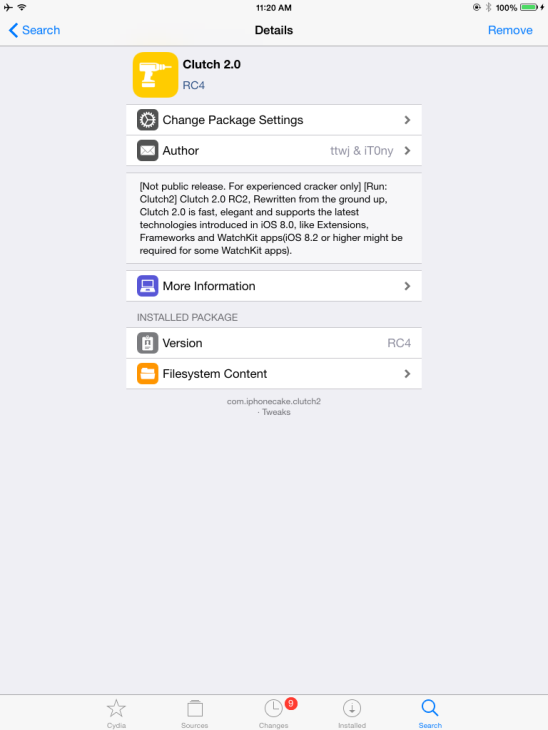
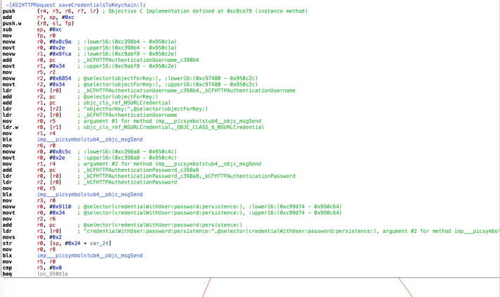

## 5.4 解密iOS应用

由于iOS app被苹果的FairPlay DRM加密过，第三方下载的解密版本是不可用的。虽然加密的IPA文件可以从iTurns直接下载，这是一个手动过程来解密app，手动利用工具，例如otool，lldb，和dd。非常感激，这个可以用Clutch2工具自动地完成。

Dumpdecrypted是另外一个可以将解密的iOS应用dump到一个文件中的工具，但是本章不会使用。Dumpdecrypted可以在仓库中找到：
[https://github.com/stefanesser/dumpdecrypted](https://github.com/stefanesser/dumpdecrypted)

### 5.4.1 Getting Ready

本节中，将会使用otool，这是一个包含在XCode中的命令行工具。可以在OS X终端中执行以下命令完成XCode命令行工具的安装：

```java
    $ xcode-select -install
```

使用Clutch2来解密应用。Clutch2可以在Github仓库[https://github.com/KJCracks/Clutch](https://github.com/KJCracks/Clutch)中下载，或者通过在你的jaibroken设备中添加[http://cydia.iphonecake.com](http://cydia.iphonecake.com)源用Cydia安装完成,完成后可以搜索Clutch 2.0，如以下截图所示：



### 5.4.2 How to do it...

<br>&emsp;&emsp;&emsp;1. 为了找出一个应用是都被加密了，IPA文件必须被重命名为ZIP文件，并且必须在节约的重命名文件夹内定位应用二进制。例如，对应用二进制执行以下命令，而不是IPA文件，来检测应用是否被加密了。如果crypt id值为1，这就意味着应用被加密了：

```java
$ mv MySubaru.ipa MySubaru.zip
$ unzip MySubaru.zip
$ cd Payload/MySubaru.zpp/
$ otool -l MySubaru | grep -A 4 cryptid
cryptid 1
cryptid 1

```

现在说明应用时被加密了的。手动解密应用超出本书的范围，然而应用解密过程可以由Clutch2可以自动化完成。当不带参数运行Clutch2时，所以安装的应用会被列出：

```java
# Clutch2
Installed apps:
1:  SUBARU STARLINK <com.subaru-global.infotainment.gen2>
```

<br>&emsp;&emsp;&emsp;2. 接下来，使用-d标记来dump要解密的应用，并选择序号，这里，需要解密和dump的应用序号是1：

```java
# Clutch2 -d 1
Now dumping com.subaru-global.infotainment.gen2
DEBUG | ClutchBundle.m: -[ClutchBundle prepareForDump] [Line 30] |
preparing for dump
<Redacted>
DUMP | <ARMDumper: 0x14695030> armv7 <STARLINK> ASLR slide: 0x4f000
Finished dumping binary <STARLINX> armv7 with result: 1
DONE: /private/var/mobile/Documents/Dumped/com.subaru-
global.infotainment.gen2-iOS6.1-(Clutch2.0 RC4).ipa
DEBUG | FinalizeDumpOperation.m:__30-[FinalizeDumpOperation
start]_block_invoke_2 [Line 60] | ending the thread bye bye
Finished dumping com.subaru-global.infotainment.gen2 in 35.2
seconds
```


<br>&emsp;&emsp;&emsp;3. 应用现在被解密了。将解密的应用传输到电脑主机中，使用如下所示的scp命令，：

```java
$ mv -v /private/var/mobile/Documents/Dumped/com.subaru-
global.infotainment.gen2-iOS6.1-(Clutch2.0 RC4).ipa'
Tester@<HostIPAddress>:~/
```


<br>&emsp;&emsp;&emsp;4. 重命名解密得到的IPA文件为ZIP文件，步骤跟前面验证应用是否加密是类似的：
```java
$ mv com.subaru-global.infotainment.gen2-iOS6.1-\(Clutch2.0\
RC4\).ipa com.subaru-global.infotainment.gen2-iOS6.1-\(Clutch2.0\
RC4\).zip
Unzip the folder and a new "Payload" directory will be created.
$ unzip com.subaru-global.infotainment.gen2-iOS6.1-\(Clutch2.0\
RC4\).zip 
```

<br>&emsp;&emsp;&emsp;5. 将应用二进制文件的位置改为Payload/STARLINK.app目录：

```java
$ cd Payload/STARLINK.app/
$ ls -lah STARLINK
-rwxrwxrwx 1 Tester staff 30M Jun 7 17:50 STARLINK
```

<br>&emsp;&emsp;&emsp;6. 应用二进制内容可以使用工具反编译进行更进一步的分析，工具有Hopper。类信息也可以用class-dump工具dump出来，并用汇编器进行更深入的分析。例如，如下图所示，可以利用Hopper检查认证信息是如何通过`saveCredentialsToKeychain`类来存储的：




利用应用的类和函数的其他知识，应用的功能可以通过动态或者运行时分析进行操作和测试。本章的后面将会讲述动态测试。

### 5.3.3 See also
* OWASP的移动测试指南提供了更多的信息来dump加密的iOS应用（[https://github.com/OWASP/owasp-mstg/blob/master/Document/0x06b-BasicSecurity-Testing.md](https://github.com/OWASP/owasp-mstg/blob/master/Document/0x06b-BasicSecurity-Testing.md)）