## 5.5 使用MobSF进行静态分析

由于iOS和Android应用二进制文件都以及获取到，我们可以自动化技术进行更深入的分析。一个python实现的可以用于Android和iOS应用的好工具是Mobile Security Framework)NobSF).MobSF可以为我们提供一些特性和能力，尤其是对于Android应用。本节将会介绍MobSF对Android和iOS应用的自动化静态分析特性。静态分析尤其需要访问应用的源码，然而，反编译Android和iOS应用可以为我们提供一些与源码形式相近的伪代码。

### 5.5.1 Getting Ready

0.9.5.2beat版的MobSF已经被安装在随书的虚拟机中。MobSF经常更新和下载在此网址[https://github.com/MobSF/Mobile-Security-Framework-MobSF](https://github.com/MobSF/Mobile-Security-Framework-MobSF)。保证已经安装了MobSF文档中列出的依赖。

保证已经获取到了目标APK和解密的iOS IPA应用。MobSF不能自动地解密iOS应用。MobSF需要一个解密的IPA文件进行分析，而不是重命名后的应用Payload中的二进制文件。由于MobSF自动完成了这一步（MobSF是一个开源的，并可以通过修改来使用原始二进制文件而不是IPA文件）。Clutch2可以在iOS设备中使用-d标记dump IPA文件。

### 5.5.2 How to do it...

<br>&emsp;&emsp;&emsp;1. 在终端中执行以下命令可以启动MobSF：

```java
$ python manage.py runserver
```

<br>&emsp;&emsp;&emsp;2. 启动成功后，你的浏览器地址为17.0.0.1:8000的地址会显示MobSF的web-UI，如下截图所示：

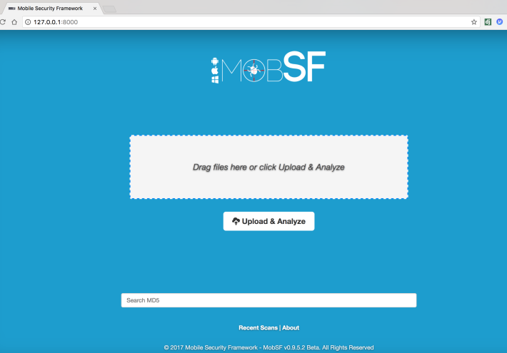


#### 5.5.2.1 Android静态分析

<br>&emsp;&emsp;&emsp;1. 开始，我们将会分析Android应用。拖动目标APK文件到MobSF的web接口，MobSF将会自动反编译和分析有内容。在这个接口中，Android的四大组件（ACTIVITIES,SERVICES,RECEIVERS, and PROVIDERS）作为应用的元数据列举出来。

 MobSF允许灵活使用不同的Java反编译器和Dex to Jar转换器。看一下MobSF/settings.py配置文件如何修改这些配置：

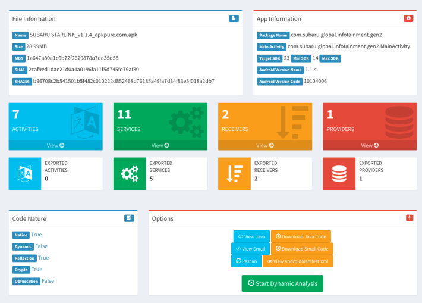

<br>&emsp;&emsp;&emsp;2. 向下滚动，MobSF分析了应用的权限、Android API使用、可浏览的Activities和其他许多可能用到的静态分析功能。我们将会看的一个最有用的区域就是代码分析部分。这里，MobSF大概地标记了较差的编程实践和潜在的易受攻击的代码片段：

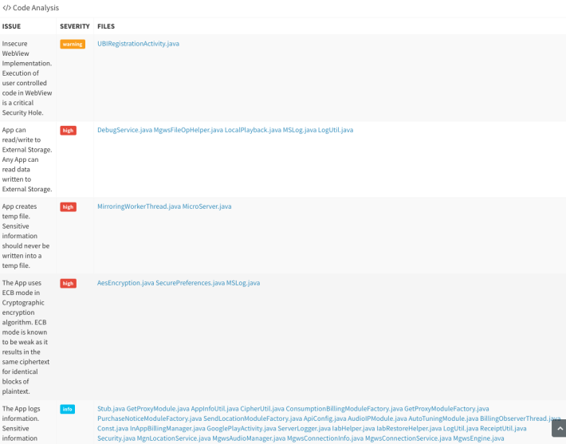

<br>&emsp;&emsp;&emsp;3. 能够利用和查看的最方便的部分之一是Files may contain hadcoded sensitive infomation like username,password,keys等（可能包含硬编码的用户名、密码和秘钥等敏感信息的文件）下图是一个被MobSF标记的在应用中可能包含硬编码敏感信息的Java类的实例：


<br>&emsp;&emsp;&emsp;4. 在移动应用中，硬编码OAuth client_secret值和云提供者API账户认证信息是很常见的。一个类似的例子在CES的硬编码iBeacon的章节中给出了。当选择一个被标记的Java类时，Java伪代码将会出现，展示下图中的一些硬编码值：

2016年，三星因为在SmartThings中硬编码client_secret值，变成受害者，授予了攻击者bearer token访问门锁。关于这个的更详细的信息可以在下面的论文中找到[https://web.eecs.umich.edu/~earlence/assets/papers/smartthings_sp16.pdf](https://web.eecs.umich.edu/~earlence/assets/papers/smartthings_sp16.pdf)。

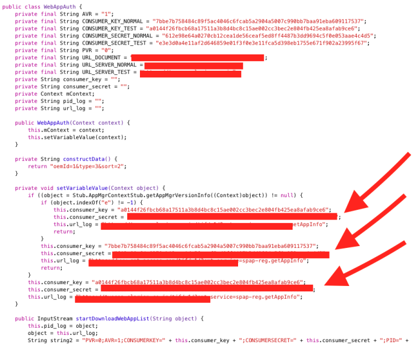

<br>&emsp;&emsp;&emsp;5. 利用MobSF,测试Android应用是很简单的。而对于使用MobSF分析iOS应用就不像分析Android应用那样简单了。


#### 5.5.2.2 iOS静态分析

<br>&emsp;&emsp;&emsp;1. MobSF也确实提供了有用的特性来分析iOS应用。像Android一样，解密的iOS IPA文件可以被拖到MobSF的web接口。MobSF会重命名IPA文件为ZIP文件，提取内容，分析plist文件，检查应用申请的权限，dump类信息等等其他事情。下面截图是拖到IPA文件到MobSF后的页面。MobSF提供的三个主要选项，包括查看`Info.plist`, `Strings`和`class dump`：

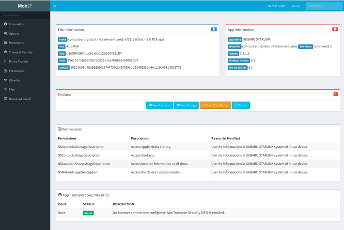

保证在MobSF的配置文件中修改了你的 `class-dump-z`路径， 配置文件路径为`MobSF/settings.py`,并在其中查找`CLASSDUMPZ_BINARY`。在我的案例中，`class-dump-z`路径被设置为`/opt/iOSOpenDev/bin/classdump-z`，然而，使用常规的`class-dump`也能正常工作，其路径是`/opt/iOSOpenDev/bin/class-dump`。

<br>&emsp;&emsp;&emsp;2. 第一个你要看的地方是`Info.plist`文件。`Info.plist`文件包含了关于应用的基本信息，例如权限，IPC URL模式，和应用传输安全设置，这些MobSF已经为我们提取好了。下图展示了MobSF中展示的`Info.plist`文件内容：

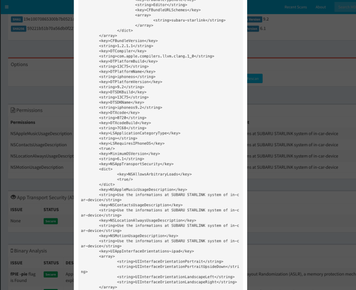

<br>&emsp;&emsp;&emsp;3. 接下来，选择`strings`按钮，如下图所示，就回展示在二进制中的字符串。：

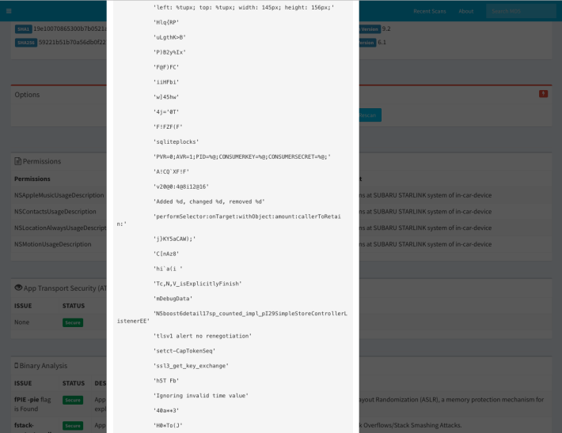

<br>&emsp;&emsp;&emsp;4. 注意，这里有一个字符串为`CONSUMERSECRET`，这在Android应用中也发现了。常常是Android应用中发现了硬编码字符，在iOS中也会，反之亦然。在我们看了MobSF dump的类信息后，我们将会验证这一点。点击`View Class Dump`按钮，来查看应用的类信息。如果你正确地设置了二进制配置，一个分离的tab项会打卡并展示类信息，如下图所示：

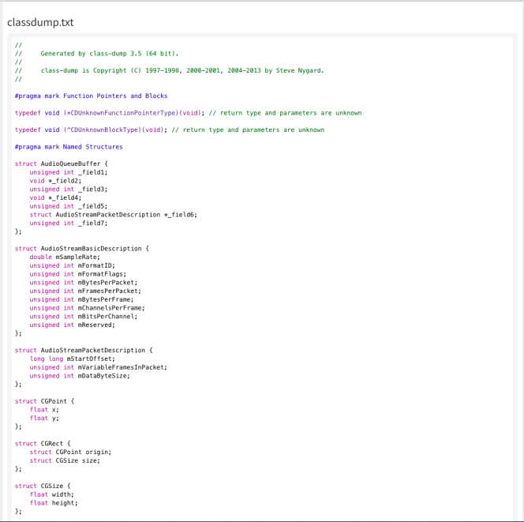

<br>&emsp;&emsp;&emsp;5. 我们可以看到类详细信息，我们可以查明应用内的功能来分析。例如，我们可以在反编译器中搜索累着的密码字符串来分析，如Hopper。下面的截图展示了被使用的类`addBasicAuthenticationHeaderWithUsername`：

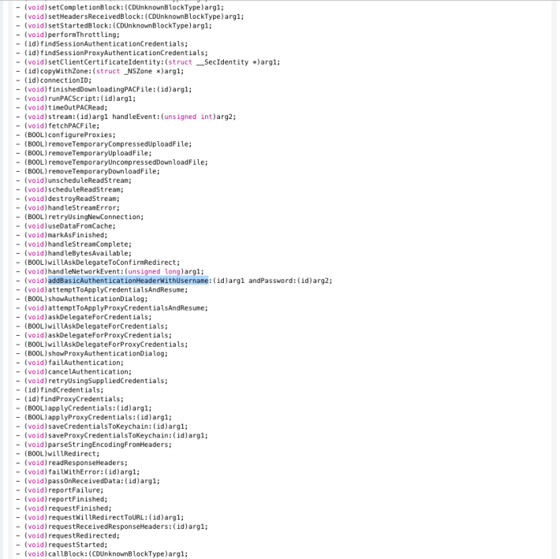

<br>&emsp;&emsp;&emsp;6. `addBasicAuthenticationHeaderWithUsername`可以在Hopper中进行更深入的分析，如下所示查看他的伪代码，在String tab中搜索`addBasicAuthenticationHeaderWithUsername`类的内容：

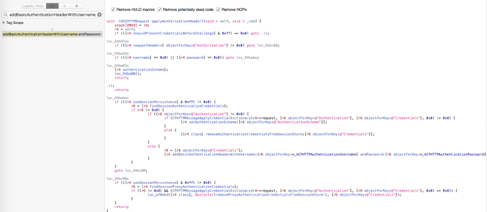

<br>&emsp;&emsp;&emsp;7.由于我们在Hopper中，并且定位到了之前提到的**CONSUMERSECRET**，我们可以搜索这个字符串来检查是否被硬编码到iOS应用。其中一个硬编码的密码值是**c4c5**, 在下面的截图中高亮显示了：

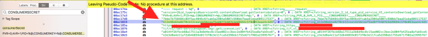

<br>&emsp;&emsp;&emsp;8. 当在应用中定位这些硬编码值时，常见的下一步测试是通过动态分析验证他们的影响。动态分析测试将会在本章后面讲到：


### 5.5.3 There's more...

本节中，我们覆盖了Android和iOS应用的静态分析。我们没有涉及到运行时分析测试，这意味着在应用运行时hook应用类和函数。取决于你愿意花多少时间和努力在测试一个应用上，这可能不总是在你的范围内。运行时分析对于验证客户端安全控制是很棒的，例如绕过pin码锁屏界面或者暴力登录。OWASP测试指南提供了Android和iOS应用的运行时分析技术的更详细信息。浏览下面的链接查看更多的信息
* **Android**
[https://github.com/OWASP/owasp-mstg/blob/master/Document/0x05c-Reverse-Engineering-and-Tampering.md](https://github.com/OWASP/owasp-mstg/blob/master/Document/0x05c-Reverse-Engineering-and-Tampering.md)
* **iOS**
[https://github.com/OWASP/owasp-mstg/blob/master/Document/0x06c-Reverse-Engineering-and-Tampering.md](https://github.com/OWASP/owasp-mstg/blob/master/Document/0x06c-Reverse-Engineering-and-Tampering.md)