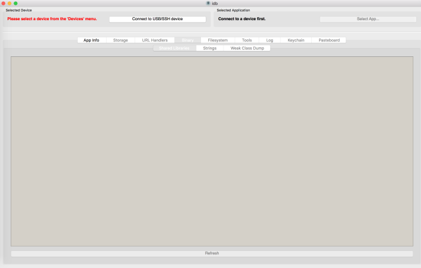
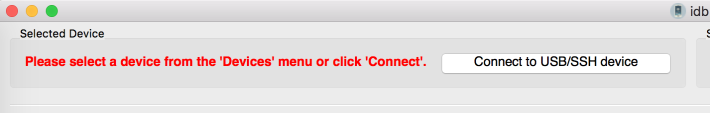
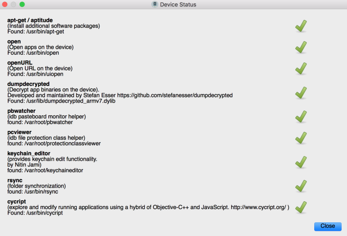
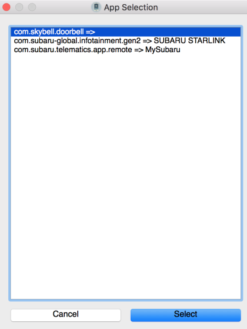
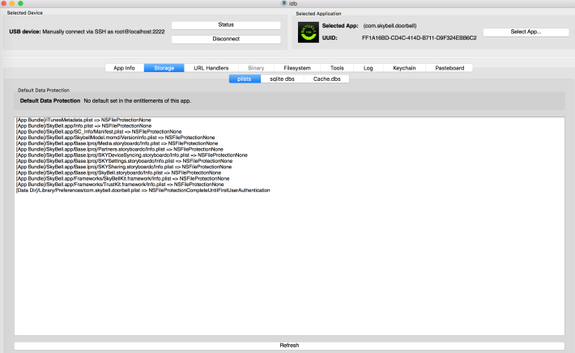
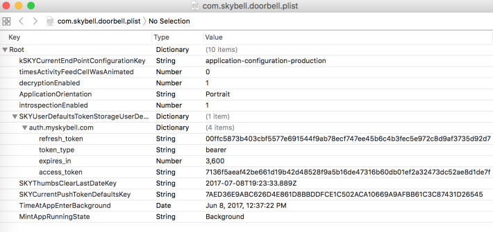
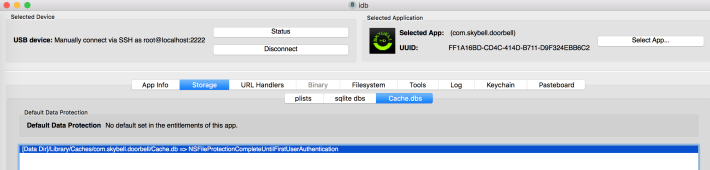
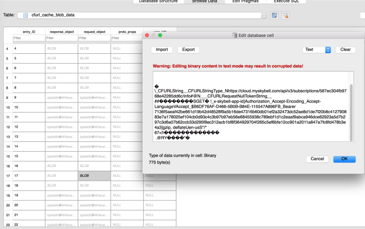

## 5.6 使用idb分析iOS数据存储

不幸的是，iOS开发者倾向于忽视苹果提供的数据存储API。这导致了数据泄露，由于使用明文数据库（包括realm DB），plist文件（属性列表），缓存，键盘和其他存储位置。有时，应用程序使用的混合框架鼓励此行为用于应用程序性能但未列出安全性影响。依赖于混合框架和自定义模块，可能需要一些插件来清楚路径，例如缓存，这导致了开发者的开发复杂度。本节将会辅助你进行iOS应用的数据存储分析。

### 5.6.1 Getting Ready

本节，需要一个一个已经越狱的iPhone设备，和一个免费的工具idb。idb是一个可以在OS X中运行的免费工具，Ubuntu系统用于简化常见的iOS应用的安全评估任务。他现在已经安装在使用的虚拟机中，如果你想手动安装，可以查看idb的网页。[http://www.idbtool.com/](http://www.idbtool.com/)。如果你使用**gem**来管理Ruby，你可以使用**gem install idb**来安装idb。

Tips： 写本书的时候，idb不支持iOS 10应用。

为了查看SQLite数据库项，可以通过[http://sqlitebrowser.org](http://sqlitebrowser.org)下载和安装sqlitebrowser。这本书使用的虚拟机中包含了SQLite浏览器。

### 5.6.2 How to do it...

 &emsp;&emsp;&emsp;1. 从终端启动idb，简单的执行idb就行，idb的用户接口就会出现：

 &emsp;&emsp;&emsp;2. 接下来，选择**Connect to USB/SSH device**：

 &emsp;&emsp;&emsp;3. 如果这是你第一次使用idb，需要在你的越狱设备上安装一些依赖包，如果idb可以通过USB或者SSH访问你的设备，他会自动安装这些包。这些包在下面的截图中列举出来了：

Tips: 越狱设备的默认用户名和密码是alpine。

 &emsp;&emsp;&emsp;4. 如果所有需要的包都安装了，用**App Selection**菜单选择一个应用。在本案例中，我们选择了**com.skybell.doorbell**应用：

 &emsp;&emsp;&emsp;5. 选择了**com.skybell.doorbell**应用后，我们可以关注于应用内容和应用的数据时如何存储的。这有许多可以自动进行iOS应用评估任务的特性，然而本展示中，将会分析存储。为了分析应用的数据存储，选择**Storage**项，选择**plist**项，并点击**Refresh**按钮：

 &emsp;&emsp;&emsp;6. 这里出现了很多文件，但是很多与我们的目标是不相关的。分析最开始需要考虑的文件是`Info.plist`,该文件在应用的bundle目录下，还有一些应用在运行时创建的引用文件。本案例中的引用文件是**com.skybell.doorbell.plist**。在明文的plist文件中，我们需要查看的是公司或者用户的个人或者敏感数据。如果我们双击打开引用文件，我们将会看到OAuth `access_token`和`refresh_token`存储在未受保护的存储中（CVE-2017-6082）。这些明文token可以在下面的截图中看到。尤其是，`access_tokens`持久化能够改善用户体验，所以每次在应用打开后进入就不需要再获取access_token：

 &emsp;&emsp;&emsp;7. 机会是，当session tokens是明文时，数据在很多区域都没有被安全存储。在磁盘中，常见的查找敏感信息的区域是数据库或者应用启动时生成的`data`目录下的文件。idb可以分析这些区域的文件。我们将查看**Cache.db**项，并看看我们找到什么。

导航到**Cache.dbs**项，选择**Refresh**按钮，并双击打开**Cache.db**项：

 &emsp;&emsp;&emsp;8. 正如以下截图所示，在这个SQLite数据库中有许多表：

 &emsp;&emsp;&emsp;9. 这些表中包括可以作为文本查看的BLOB数据。正如他显示的，应用缓存了所以请求和响应，这里面保护了个人信息和token数据（CVE-2017-6084)：

Tips: 自定义的SQLite外部编辑器可以用通过idb的设置来指定特定的编辑器路径完成。

当黑客将受害者的手机插到开启了自动备份的iTunes中时，这些数据就回被偷。攻击者需要插入一个测试iPhone设备，并存储数据到受害者的备份中。另一个技术包括使用已经授权访问一个未越狱设备的文件系统的工具，例如iFunbox。在这一点上，攻击者可以在外部转换应用的Cache.db，plists和SQLite数据库，来获取session token和其他个人账户信息的访问。在本案例中，攻击者可以查看来自门铃的视频流，并改变动作设置来改变它的配置，或者分享视频流到一个外部账户。

有了这些知识后，session管理控制和API数据可以被查看，而不需要代理连接。session过期设置和随机化测试可以用来分析，根据前面提到的移动应用安全检查表。`plist`文件和`Cache.db`中的数据可以被修改，并会被上传回设备来观察设备的信任关系。

### 5.6.3 There's more...

在本节中不讲其他位置的数据存储分析。像keychain，本地存储，域数据库，日志，BinaryCookies和很多其他的存储位置，我们不讨论。回顾OWASP的移动测试指南，可以查看关于测试iOS应用的数据存储弱点技术的更详细信息[https://github.com/OWASP/owasp-mstg/blob/master/Document/0x06d-Testing-Data-Storage.md](https://github.com/OWASP/owasp-mstg/blob/master/Document/0x06d-Testing-Data-Storage.md)

### 5.6.4 See also

* 可以查看idb的文档，学习更多的idb的特性[http://www.idbtool.com/documentation/](http://www.idbtool.com/documentation/)