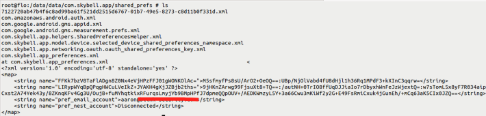
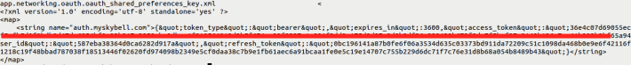
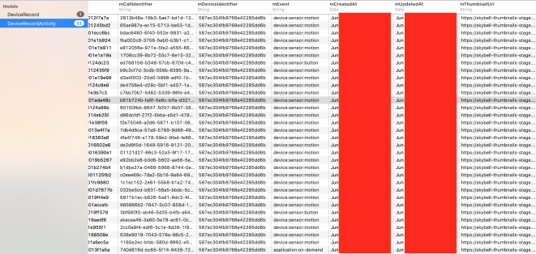

## 5.7 分析Android数据存储

有很多方法运行时分析Android数据存储。免费版，和商业版，Android测试发行版可用于帮助查看和修改常见的数据存储文件位置。我们想要手动分析下面几个常见的存储位置：

* /data/data/<package_name>/
* /data/data/<package_name>/databases
* /data/data/<package_name>/shared_prefs
* /data/data<package_name>/files/<dbfilename>.realm
<br>&emsp;&emsp;&emsp; * 需要一个Realm浏览器([https://itunes.apple.com/us/app/realm-browser/id1007457278](https://itunes.apple.com/us/app/realm-browser/id1007457278))

* /data/data/<package name>/app_webview/
<br>&emsp;&emsp;&emsp; * Cookies
<br>&emsp;&emsp;&emsp; * Local storage
<br>&emsp;&emsp;&emsp; * Web data
* /sdcard/Android/data/<package_name>

对于Android，应用的文件结构不改变，使得手动分析更加简单。本节将会辅助你进行IoT Android应用的数据存储分析。
### 5.7.1 Getting Ready

本节需要下面的事项：
* 一个越狱的安卓设备（打开了USB debugg）或者一个安卓模拟器
* Android debug bridge（ADB): ADB在伴随虚拟机里已经安装了，或者可以通过下面的URL手动安装[https://developer.android.com/studio/releases/platform-tools.html](https://developer.android.com/studio/releases/platform-tools.html)

### 5.7.2 How to do it...

<br>&emsp;&emsp;&emsp;1. 保证使用以下命令连接上一个测试安卓设备或者模拟器：

```java
# adb devices
Lits of devices attached
0a84ca7c device
```

<br>&emsp;&emsp;&emsp;2. 连接到测试设备控制台，并切换到root用户，使用一下命令：

```java
# adb shell
shell@flo:/ $ su
root@flo:/ #
```

<br>&emsp;&emsp;&emsp;3. 像下面这样改变目标应用的目录：：


```java
# cd data/data/com.skybell.app/
# ls -al
    drwxrwx--x u0_a92 u0_a92 2017-06-23 14:59
    app_7122720ab47b4f6c8ad99ba61f521dd2515d6767-01b7-49e5-8273-
    c8d11b0f331d
    drwxrwx--x u0_a92 u0_a92 2017-01-30 18:46 cache
    drwxrwx--x u0_a92 u0_a92 2017-01-17 16:41 files
    lrwxrwxrwx instll install 2017-06-23 14:58 lib -> /data/app/com.skybell.app-1/lib/arm
    drwxrwx--x u0_a92 u0_a92 2017-01-17 16:41 no_backup
    drwxrwx--x u0_a92 u0_a92 2017-06-23 15:31 shared_prefs

```

<br>&emsp;&emsp;&emsp;4. 首先，进入`shared_prefs`目录，列举出所有文件，并查看preferences文件，如下图所示：



这里出现了特殊的编码；应用正在运行，字符串可能与登录认证信息有关，但是他没有显示账户的用户名。

<br>&emsp;&emsp;&emsp;5. 接下来，我们将会检查`com.skybell.app.networking.oauth.oauth_shared_preferences_key.xml`文件，如下图所示：



<br>&emsp;&emsp;&emsp;6. 我们的OAuth tokens看起来是明文存储的，与我们在iOS应用中看到的类似。有一个叫`files`的目录，这里可能有域数据库相关内容，可以查看。切换到`files`目录，并列举出全部文件，如下图所示：


<br>&emsp;&emsp;&emsp;7. 看起来这有个应用使用的域数据库。记录下域数据库存储的位置，并拉去文件到你的主机中，使用下面的`adb`命令：


```shell
adb pull data/data/com.skybell.app/files/default.realm /path/to/staore/realdb
```

Tips: 在写本书的时候，我们仅仅可以在OS X计算机上使用App Store中的域浏览器来查看域数据库。有一些非正式的可以从源码构建的查看Android和iOS系统的域数据库的浏览器。更多的域数据库的信息可以从下面的网址中找到[http://news.realm.io/news/realm-browser-tutorial/K](http://news.realm.io/news/realm-browser-tutorial/K)。

<br>&emsp;&emsp;&emsp;8. 双击`default.realm`文件，将会在域浏览器中打开域数据库，如下图所示：



**DeviceRecord**模型陈述了门铃的名称和状态，它是否在线，而**DeviceRecordActivity**模型列举事件，它们的时间戳，和事件的缩略图。这就是一种数据泄露，可以通过将Android设备备份到计算机并像iPhone一样恢复来利用，或者如果可以的话，通过adb用一样的方式拉取数据。不幸的是，在应用的`AndroidManifest.xml`文件中的`android:allowbackup=false`并没有被标记，这可以在一定程度上缓解特定的问题，但是这仍然是不好的实践存储数据，让用户暴露在风险中或者与隐私问题有关。


### 5.7.3 See also

* 回顾OWASP的移动安全测试指南中Android应用测试数据存储脆弱点的更详细信息：[https://github.com/OWASP/owasp-mstg/blob/master/Document/0x05d-Testing-Data-Storage.md](https://github.com/OWASP/owasp-mstg/blob/master/Document/0x05d-Testing-Data-Storage.md)