## 5.8-进行动态分析测试

在这个阶段，我们已经对示例IoT移动应用进行了静态分析，并评估了数据时如何存储的。我们至今还没查看服务器和应用之间发送的API流量。运行时观察和修改应用通信数据称为**动态分析**。动态分析测试关注于在运行时评估应用。动态分析在移动平台层和移动应用的的后端服务和API层都可以进行，可以分析请求和响应。本节中，我们将会设置iOS应用的动态分析测试环境，并带你进行一些测试用例。

### 5.8.1 Getting Ready

在本节，Burp Suite和OWASP ZAP会被用来观察应用通信。本节也会进行iPhone设备和Android设备的访问。iPhone设备和Android设备不需要提前越狱或者root，这是查看应用通信的不错的部分。虽然这些步骤适用于所有移动平台，但是本节的示例是iOS的。

### 5.8.2 How to do it...

<br>&emsp;&emsp;&emsp;1. 像配置一个web应用测试环境一样，需要将ZAP和Burp Suite的证书要安装到你的越狱的设备来代理`HTTPS`请求。这可以通过调整移动设备的WiFi代理设置，指向一个Burp Suite的IP和端口，如下图所示：

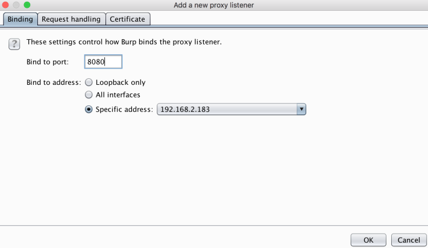

下图展示了如何设置iPhone设备指向Burp的代理监听器。本案例中，我的Burp代理监听的IP和端口是 `192.168.2.183`，`8080`:


<br>&emsp;&emsp;&emsp;2. 接下来，添加Burp的CA证书到设备，通过导航到Burp的IP地址和端口，使用/cert作为URL路径。本案例中，Burp的地址是`https://192.168.2.183:8080/cert`，如下图所示：

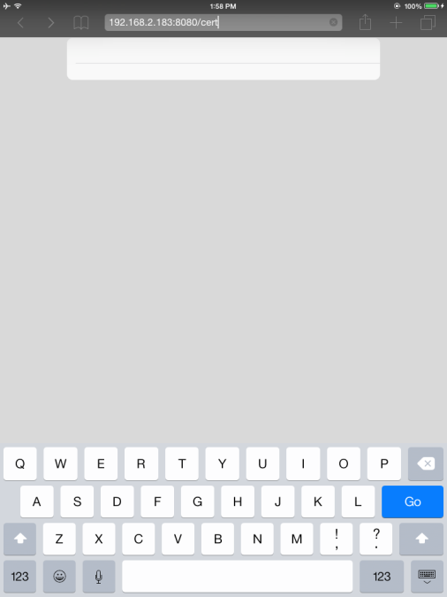

<br>&emsp;&emsp;&emsp;3. 一旦执行，iOS将会询问你是否想要安装Burp的CA证书，如下图所示。现在**Install**，然后`HTTPS`流量就可以被分析了。


下面的图显示了`HTTPS`请求从我们的移动设备上通过了Burp的代理。

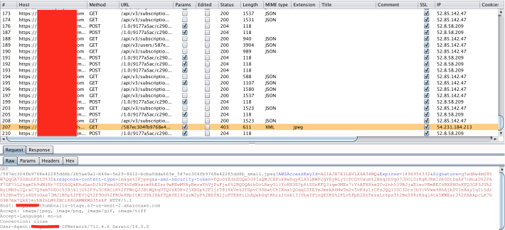

<br>&emsp;&emsp;&emsp;4. 在Android设备上可以进行类似的步骤。我们将要展示如何设置ZAP的CA证书。首先 ，通过**Tools | Options | Dynamic SSL Certificates**导出ZAP的证书。保存到Android设备上的一个便利的位置：

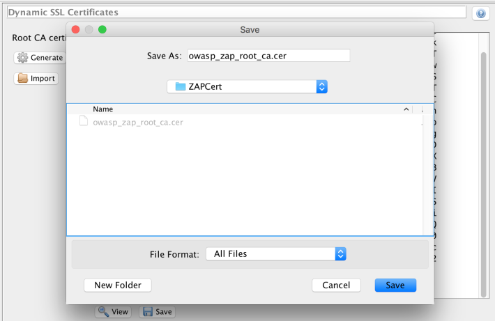

<br>&emsp;&emsp;&emsp;5. ZAPCert需要下载到Android设备上。有很多方法可以完成这个需求。一个快速且便利的小技巧是利用Python的`SimpleHTTPServer`。如果你用的是一个类unix系统，在命令行中CA的目录下执行以下指令：

```java
$ python -m SimpleHTTPServer 1111
```


<br>&emsp;&emsp;&emsp;6. 现在PYTHON的服务器运行在端口1111上。在你的Android设备上，打开一个浏览器并导航到你的监听的服务器。本案例中，IP地址是`http://192.168.2.186:1111`，如下图所示：

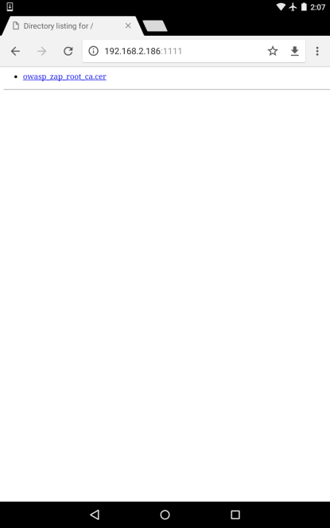

<br>&emsp;&emsp;&emsp;7. 下载证书到Android设备上。在Android设备上，从存储中导航到**Settings | Security | Install**，**Download**文件夹就会出现了，如下图所示：

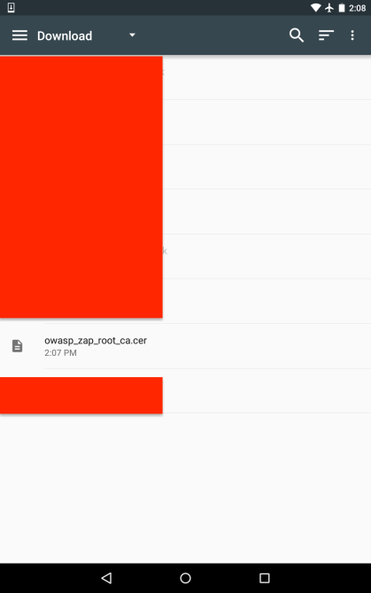

<br>&emsp;&emsp;&emsp;8. 选择ZAP的证书，给证书命名，如下图所示：

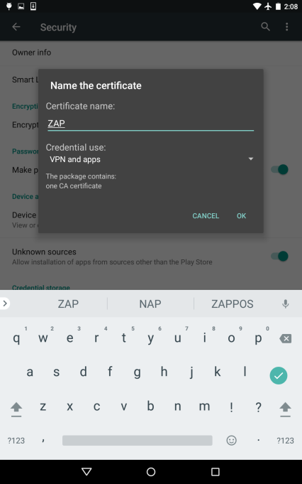

<br>&emsp;&emsp;&emsp;9. 导航到你的**Wireless**设置，修改你的代理到ZAP的代理监听器地址：


<br>&emsp;&emsp;&emsp;10. 导航到目标IoT移动应用，在ZAP的**History(历史)**栏中观察`HTTPS`的请求和响应：

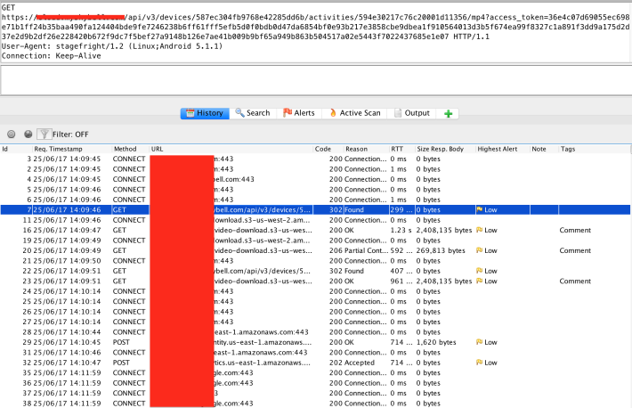

<br>&emsp;&emsp;&emsp;11. 现在Android和iOS设备都设置了应用请求和响应的代理。用这个访问，参数可以被fuzz来注入缺陷（如果测试被授权了），而且可以对应用进行业务逻辑缺陷测试。例如，当查看从我们的目标门铃传出的视频时，代理请求和响应，我们发现`access_token`被作为一个获取视频的MP4的GET请求的URL中的一个参数发送出去（CVE-2017-6085）。复制这个GET请求到我们的剪切板，复制到浏览器就可以不用用户名密码下载视频了，如下图所示：

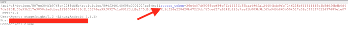

<br>&emsp;&emsp;&emsp;12. 请求被复制到了我们的剪切板：


<br>&emsp;&emsp;&emsp;13. 粘贴URL到浏览器中，观察到门铃视频自动地被下载到你本地电脑中了：


一旦复制的URL咋浏览器中请求了，浏览器会自动询问你将视频存储到你电脑的什么位置：

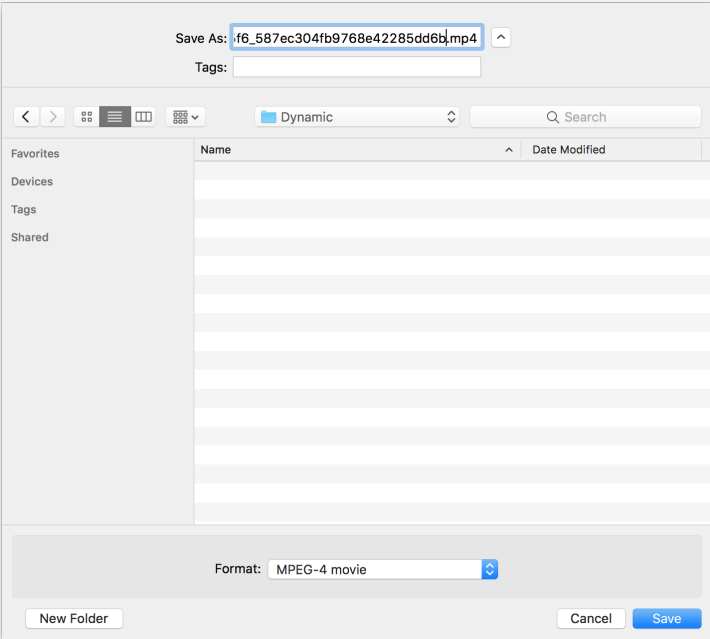

这个视频现在被下载为一个.mp4文件， 并且可以被查看了，如下图所示：

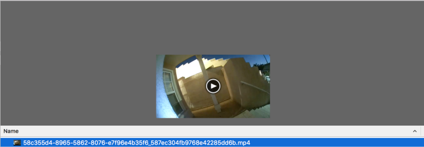

<br>&emsp;&emsp;&emsp;14. 记住，我们没有输入用户名密码来下载和观看视频。这说明门铃厂商有用户访问控制问题，并且表明产品中也会有其他问题。对于一个视频门铃，从安全和隐私视角，无认证访问视频流是一个风险。在这个发现中，可以发现一些漏洞，包括将session token作为GET请求发送，缺少token失效机制，和低效的访问控制。攻击者可以利用社会工程学和MITM技术获取必要的`access_token`。在这个发现后，可以用外部账户进行其他的访问控制测试用例。


### 5.8.3 See also

* 对于一些Android应用，MobSF可以在一个模拟器，虚拟机，甚至是物理设备中进行动态测试。Android应用的动态测试也包括测试intents和activities。在MobSF的wiki([https://github.com/MobSF/Mobile-Security-Framework-MobSF/wiki/2.-Configure-MobSF-Dynamic-Analysis-Environment-in-your-Android-Device-or-VM](https://github.com/MobSF/Mobile-Security-Framework-MobSF/wiki/2.-Configure-MobSF-Dynamic-Analysis-Environment-in-your-Android-Device-or-VM))页面中列举了一些警告。如果你测试的应用需要访问硬件，例如相机或者无线协议（Bluetooth， ZigBee或者Z-Wave）,非常建议你使用物理机手动进行测试。

* 在OWASP的移动安全测试指南中有更多的Android和iOS应用测试知识[https://github.com/OWASP/owasp-mstg/](https://github.com/OWASP/owasp-mstg/)